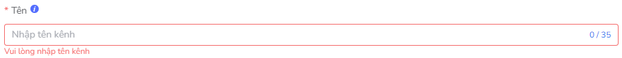

# Basic Configuration Guide
## Import Action
A few notes, as well as the general description information when the user is adding additional action, edit the data in form:

In a form that will include multiple data fields, each data field will consist of 2 components: *Title and Automotive/select data*.

Section *header* displays information .Some note the display rules of the program/system:

- The screen with the required content has a red *** * *, the data field is not vacated, forcing the user to enter the data before saving form.
- The date is known as YYYY/MM/DD HH:mm:ss.

Section *The data/select* data allows the user to enter/select the desired data.

Showing **limit of** permitted in some schools, e.g. limit 0/50, do not display 51 characters.

 <!--  -->

User data can sometimes be authenticated to make sure valid, when the user input is not valid for **, the** red error message is shown below.

The error message content depends on each specific case. The following examples include a few other types of notifications:

*Figure 1. Error vacated the field * 

*Figure 2. Valid self-signed error * 

*Figure 3. Failed entry error * 

## Data Submit
When a user performs a confirmation of the stored data in the form by pressing the **Save**. The task execution system and then return the message to the user. If the task is successful, there will be a notification of the upper end of the browser screen.

* Title: specify a command + statement (not required)

* Background:

* Icon :white_check_mark:

* Show up in 5s and automatically disable: Do the same command

If the execs failed, there will be a red message, with a bug content showing the top of the browser screen. Depending on the error case, it is shown with different content.

*Figure 4. Enter unvalid information * 

* Title: We need to specify a reason not to be valid.

* Background: Red

* Icon :x:

* Show up in 5s and disable automatically: do not execute command

