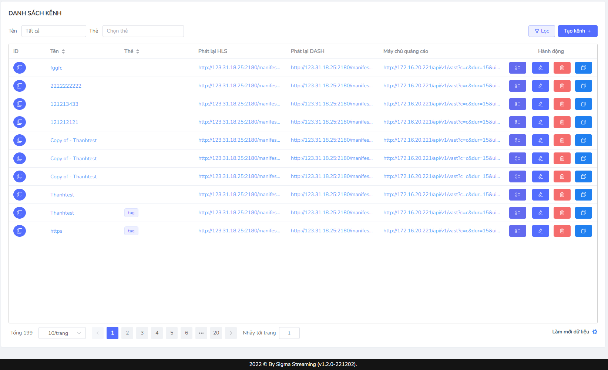

# View channel editor interface
This function displays a list of channels and allows CMS User to search the desired channel.

 At the main screen selecting **List of channels**

Display System Main View: 

* The information is displayed in the interface:

| Column Name          | Function                                                                                                                                                                                                                                                                                                                              |
| -------------------- | ------------------------------------------------------------------------------------------------------------------------------------------------------------------------------------------------------------------------------------------------------------------------------------------------------------------------------------- |
| **ID**               | After the user creates a new channel, the system generates its own ID for the channel with the purpose of identification.                                                                                                                                                                                                             |
| **Name**             | Because CMS users configure the channel name                                                                                                                                                                                                                                                                                          |
| **HLS RTS**          | Due to the birth system after the channel configuration, can click to copy the link                                                                                                                                                                                                                                                   |
| **DASH rebroadcast** | Due to the birth system after the channel configuration, can click to copy the link                                                                                                                                                                                                                                                   |
| **Ad server**        | A server provides the specifications of the advertising point based on criteria including current advertising campaigns and viewer preferences, which can click to copy the link.                                                                                                                                                     |
| **Update**           | (default arrangement) displays to the top of the page with the latest updated channel                                                                                                                                                                                                                                                 |
| **Action**           | Statistics: The navigation of the statistical views associated with the filtr the corresponding channel name.   Edit: Allow users to edit channel information.  Delete: Allow CMS users to perform delete channels.   Create a copy: Creating a single copy with the required mandatory information. |

* Other buttons

| Button Name           | Function                                                                                                                                      | Images                          |
| --------------------- | --------------------------------------------------------------------------------------------------------------------------------------------- | ------------------------------- |
| **Synchronised icon** | The right angle below the interface, always implementing the continuous system synchronous in 10s                                         
