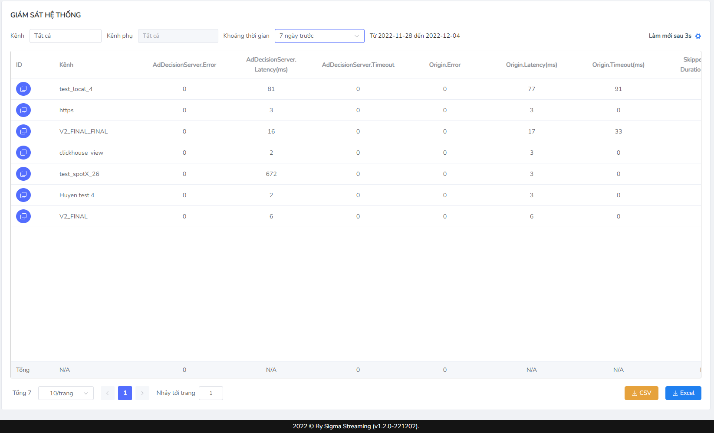

# System monitoring
Monitor System-System monitoring is the **system tracking system, error checking, how much**…  Related to the **problem of error** resulting in the failure to display a successful advertisement, which helps users to test the cause of the error here and find a way to fix (present at the channel and sub-group by channel, group by sub-channel)
## To track system monitoring indicators
**Step 1:** At sidebar, select Statistics Display selection list **Step 2:** Users select System Monitor

System Monitor Display System: 
* Quick filter:
    * **Channel**: existing channel list channels
    * **sub-channel**: do not allow the option channel to select a specific channel that has not selected a specific channel
    * **Time**: 3-month maximum query time.
* Synchronised icon
* Page
* The CSV button appears file in the form of CSV
* The Excel button comes out of the file as Excel.

The table below explains the display information on the interface.

| Name                              | Explain                                                                                                                                                                                                                                                                                                                                                                        | Data Type | Unit         | Formula |
| --------------------------------- | ------------------------------------------------------------------------------------------------------------------------------------------------------------------------------------------------------------------------------------------------------------------------------------------------------------------------------------------------------------------------------ | --------- | ------------ | ------- |
| Latency                           | Request ' s response speed                                                                                                                                                                                                                                                                                                                                                     | Number    | Millireconds | N/A     |
| Timeout                           | The time that the installation of the request must respond (requires a user's access to take more time to wait than normal/dev can config timeout) when it exceeds this time that your connection has been 'running out of time', returning timeout information.                                                                                                               | Number    | Millireconds | N/A     |
| AdDecisionServer.Error            | The number of state code responses is not 200, the blank response and the time responses that SSAI received from the ad during the specified SSAI period.                                                                                                                                                                                                                      | Number    |              | Count.  |
| AdDecisionServer.Latency          | The average response time for the requirements provided by the SSAI for advertising. (**Not counting the last total because there is no**)                                                                                                                                                                                                                          | Number    | Millireconds | Avg     |
| AdDecisionServer.Timeout          | The number of time required for advertising during the specified SSAI period.                                                                                                                                                                                                                                                                               
