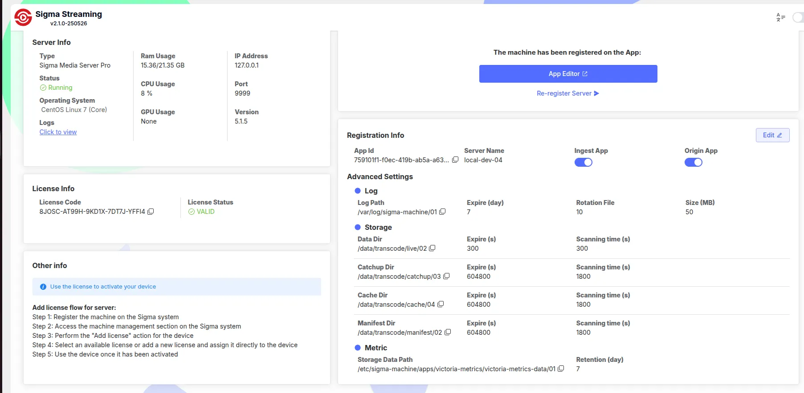
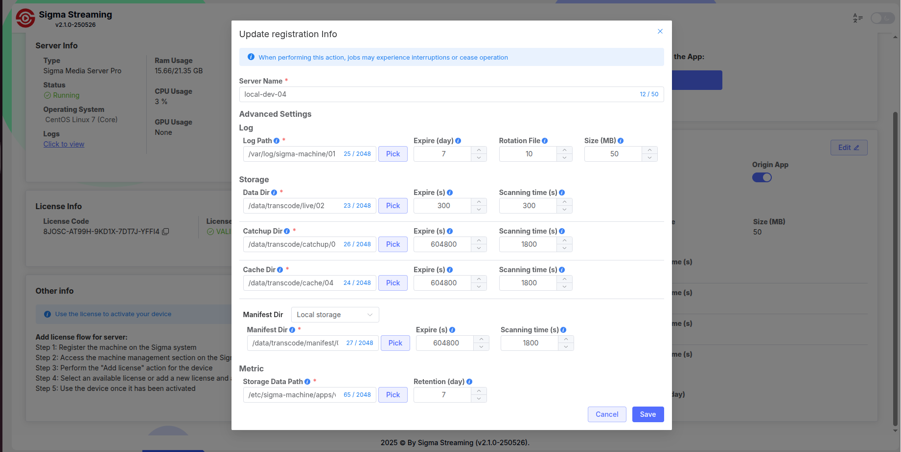

# Guide to Updating Sigma Media Server on Ubuntu
This document provides instructions on how to update **Sigma Media Server** to a new version on machines with an existing installation, including:

- Updating via `apt-get`
- Upgrading configuration via the web interface
- Updating configuration via API (`curl`)

> 🔒 Note: Always back up your data and configuration before updating to avoid data loss.


## 1. Check Current Version

Before updating, check the current version:

```bash
sigma-media-server --version

```

📝 **Note:** Record the version to compare after the upgrade. This helps confirm a successful update.


## 2. Backup Before Upgrading

Before updating, you should back up:

```bash
# Backup configuration
sudo cp -r /etc/sigma-machine /backup/config_$(date +%F)

```


## 3. Update to the New Version

Suppose you want to update to version **5.1.5.rc5.beta**:

```bash
# Update package list from repository
sudo apt-get update

# Update Sigma Media Server to a specific version
sudo apt-get install -y sigma-media-server=5.1.5.rc5.beta

```

> 🔍 Note:
> 
> - Add `-y` to auto-confirm installation.
> - If the version is not available, check the repository and APT configuration.


## 4. Post-Upgrade Checks

```bash
# Check version
sigma-media-server --version

# Restart Sigma Media Server
sudo systemctl restart sigma-media-server

# Check service status
sudo systemctl status sigma-media-server

```

- The new version should match the one you just updated to.


## 5. Upgrade Configuration via Web Interface

1. Access the web interface:
    ```
    http://<your-ip>:8019
    ```
   
2. Click **Edit** to modify the configuration:
    - Update new information if needed
    - Keep defaults if you don't want to change anything
   
3. Click **Save** to save and apply the upgrade.


## 6. Update Configuration via API (`curl`)

You can update the machine configuration via API:

```bash
curl 'http://localhost:9081/api/machine-client/machine' \
  -X PATCH \
  -H 'Content-Type: application/json' \
  --data-raw '{
    "name": "local-dev-server",
    "configuration": {
      "ingest": true,
      "origin": true
    },
    "log": {
      "path": "/var/log/sigma-machine",
      "expire": 7,
      "numberOfFileRotation": 10,
      "logFileSize": 50
    },
    "data": {
      "path": "/data/transcode/live",
      "expire": 300,
      "clearTimeInterval": 300
    },
    "catchup": {
      "path": "/data/transcode/catchup",
      "expire": 604800,
      "clearTimeInterval": 1800
    },
    "cache": {
      "path": "/data/transcode/cache",
      "expire": 604800,
      "clearTimeInterval": 1800
    },
    "metric": {
      "path": "/etc/sigma-machine/apps/victoria-metrics/victoria-metrics-data",
      "retention": 7
    },
    "manifest": {
      "path": "/data/transcode/manifest",
      "expire": 604800,
      "clearTimeInterval": 1800
    }
  }'

```

---

## 7. Explanation of Important Parameters

| Field | Description | Unit |
| --- | --- | --- |
| `log.expire` | Log retention time before deletion | Days |
| `log.numberOfFileRotation` | Number of log rotation files | Integer |
| `log.logFileSize` | Maximum size per log file | MB |
| `data.expire` | Output data retention time | Seconds |
| `data.clearTimeInterval` | Interval to check and delete expired data | Seconds |
| `catchup.expire` | Catchup content retention time | Seconds |
| `cache.expire` | Cache retention time before auto-deletion | Seconds |
| `manifest.expire` | Manifest file retention time | Seconds |
| `metric.retention` | Metrics retention time in VictoriaMetrics | Days |
