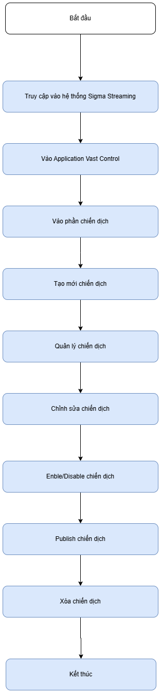
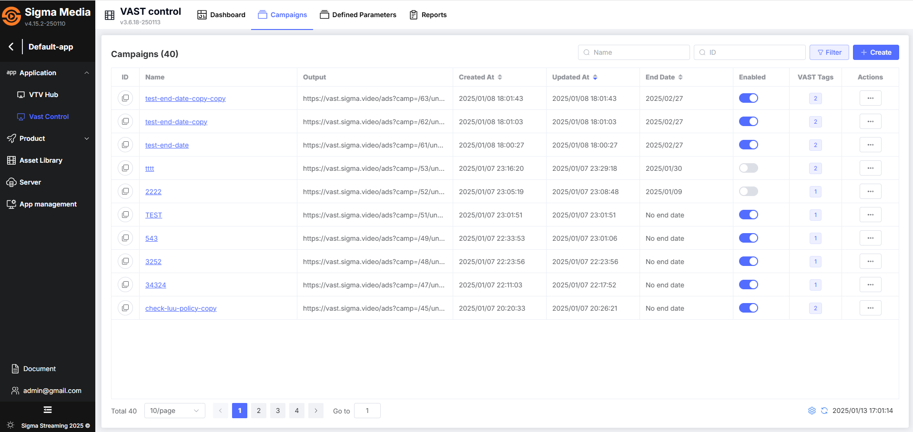
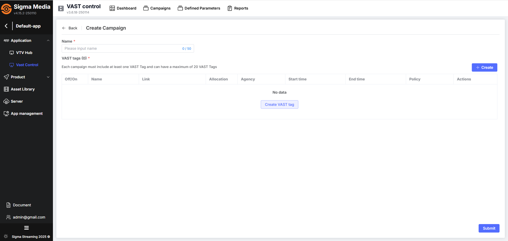

## Getting Started with VAST Control
## Preparation
Before getting started, you need to prepare the following:
- Have an account to access the **Sigma Streaming Platform** management system at `https://portal.sigma.video`
- The account must have authorized access to the Vast Control app
- Prepare a list of VAST tag URLs

## Implementation Flow

## Accessing the Sigma Streaming System
Register an account or log in to access the Sigma Streaming Platform management system at https://portal.sigma.video

The list of applications will be displayed. Select the application you want to access.

The application overview page will be displayed by default.

## Accessing the Vast Control Application

1. In the Sidebar, select the Vast Control Application
2. Select the Campaigns tab

## Create New Campaign
To create a new campaign, follow these steps:

1. Access the campaign list management page
2. On the campaign list screen, click the **Create** or **Create Campaign** button
3. Go to the campaign creation screen
4. Fill in all required information including:
  * Campaign name
  * Create a list of VAST Tags
  
  

5. Click the **Confirm** button after configuring all necessary information
6. The system will create the campaign and update the existing campaign list

[See details here](../03-user-maunal/campaign/b-create-campaign.md)

## Campaign Management
In the campaign list, you can view various campaign information including:

* **ID**: Campaign ID that you can copy by clicking the ID icon
* **Name**: Campaign name
* **Output**: System-generated output for the campaign
* **Creation Date**: Time when the campaign was created
* **Update Date**: Time when the campaign was last updated
* **End Date**: Campaign schedule end time
* **Enabled**: Enable/disable status of the campaign
* **VAST Tags**: Number of VAST Tags contained in the campaign
* **Actions**: Permitted actions for the campaign

Click on the **"campaign name"** to view detailed information including:
* General information
* VAST Tags information

[See details here](../03-user-maunal/campaign/a-campaign-management.md)

## Edit Campaign
You can edit a campaign by clicking the three-dot menu in the actions column and selecting Edit. Then follow these steps:

1. On the edit screen, modify the information as desired
2. Click Confirm after making your changes
3. The system will update the campaign information

[See details here](../03-user-maunal/campaign/a-campaign-management.md)

## Enable/Disable Campaign
You can Enable/Disable a campaign by clicking the three-dot menu in the actions column and selecting Enable/Disable.

[See details here](../03-user-maunal/campaign/a-campaign-management.md)

## Publish Campaign
You can publish a campaign by clicking the three-dot menu in the actions column and selecting Publish.

[See details here](../03-user-maunal/campaign/a-campaign-management.md)

## Delete Campaign
After successfully creating and running campaigns, if for any reason you feel a campaign is no longer necessary, you can delete it.

[See details here](../03-user-maunal/campaign/a-campaign-management.md) 