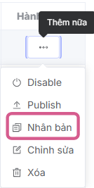
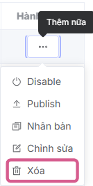
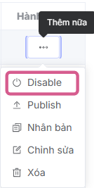

## Campaign Management
VAST Control allows you to manage and organize ad delivery campaigns easily and efficiently. This powerful tool helps you optimize advertising operations with outstanding features such as:

* **Campaign Creation:** Set up advertising campaigns with detailed parameters to meet distribution goals.
* **Quick Search:** Easily access and manage campaigns through smart search tools.
* **Flexible Management:** Monitor, edit, and optimize active campaigns in real-time.

This tool helps you save time, optimize workflows, and ensure maximum advertising campaign effectiveness.

## View Campaign List
The campaign list interface is an important part of campaign management. The interface includes basic campaign information such as ID, name, output, creation time, etc., and allows searching, helping administrators get an overview.

**Step 1:** In the left sidebar menu, move the mouse cursor to **Application** and select **Vast Control**

The system's main screen displays the Dashboard interface (monitoring overview information and metrics related to **Vast Control**) [See details here](../dashboard.md)

**Step 2:** Select the **Campaigns** tab

The screen displays the campaign list, with main information including:

|Column Name       | Function                                                    |
| -------------- | ------------------------------------------------------------ |
| **ID**         | After creating a new campaign, the system generates a unique ID for each campaign for identification purposes  Displayed as a button, allows hovering to view ID and clicking to copy |
| **Name**        | Campaign name             |
| **Output**      | After creating a new campaign, the system generates an output for each campaign to link with SSAI products  Allows hovering to view output and clicking to copy|
| **Creation Time** |Campaign creation time
|**Update Time**|Campaign update time
|**End Date**|Campaign end time
|**Enabled**|Number of VAST Tags contained in the campaign
|**VAST Tags**|Campaign end time
|**Actions**|**Enable/Disable campaign**: Allows users to activate or deactivate the campaign. **Publish campaign**: Allows users to publish the campaign. **Clone campaign**: Allows users to create a new copy of the campaign. **Edit campaign**: Allows users to edit campaign information. **Delete campaign**: Allows CMS users to delete the campaign.

* **Other Buttons**

|Button Name       | Function                                                    |
| -------------- | ------------------------------------------------------------ |
| **Create**         | Create a new campaign |
| **Filter**        | Filter more detailed information, including: **Update Time, Creation Time, Enabled, Output, Name, ID**             |
| **Quick filter**      | Quick filter supporting information search including: **Name, ID**|
| **Pagination** |Bottom left of interface Includes information: Total pages, items per page selection (default 10 items/page), current page, jump to desired search page
| **Sync icon** |Bottom right of interface, performs system synchronization settings:  * Settings for automatic system synchronization (default: auto off)  * Manual system synchronization (by clicking the icon)  * Last system synchronization time

## Actions
### Create Campaign
Creating campaigns in VAST Control helps you quickly set up and manage advertising campaigns effectively, optimizing distribution processes and performance tracking.

[See details here](./b-create-campaign.md)

### View Campaign Details
To perform this process, there must be at least one previously created campaign displayed in the list.

1. In the Campaign List interface, click on the desired **[Campaign Name]** to view campaign details
2. The campaign detail interface displays with the following information:
   

* **Name:** Campaign name
* **Campaign tag id:** System generates a unique Campaign tag id for each campaign for identification purposes
* **Output:** System generates output for each campaign to link with SSAI products
* **End Date:** Campaign end date
* **Enabled:** Campaign status
* ***VAST Tags list includes:***
* **On/Off:** VAST Tag activation status
* **Name:** VAST Tag name
* **Link:** VAST Tag link
* **Distribution:** Shows distribution weight of VAST Tags
* **Agency:** Advertising company name
* **Start Time:** VAST Tag start running time
* **End Time:** VAST Tag schedule end time
* **Rules:** Advertising rules configured for VAST Tag such as age, gender, etc. Allows users to click to view detailed rule information

## Edit Campaign
To perform this process, there must be at least one previously created campaign displayed in the list.

**Step 1:** In the list, in the Actions column, click on the three-dot icon and select the edit action

The system navigates to the campaign edit screen

On the edit screen, users can change campaign information and then click the **Confirm** button to update the information

After clicking **Confirm**, the system automatically returns to the campaign list screen and displays a **Campaign edited successfully** notification in the right corner of the screen, which automatically closes after 5 seconds.

## Clone Campaign
Users want to create a campaign copy with previously existing information, keeping required settings and campaign information.

To perform this process, there must be at least one previously created campaign displayed in the list.

**Step 1:** In the list, in the Actions column, click on the three-dot icon and select the clone action

Then displays the campaign configuration information screen with previously set information. Allows editing all fields.

**Step 2:** Users enter necessary information and click the **Confirm** button
The system displays a **Campaign copied successfully** notification in the right corner of the screen, which automatically closes after 5 seconds.

## Delete Campaign
To perform this process, there must be at least one previously created campaign displayed in the list.

**Step 1:** On the campaign list screen, at the campaign you want to delete, hover over the Delete action in the Actions column, and then click **Delete**

The system will display a confirmation pop-up window in the center of the screen

**Step 2:** Users click the **Confirm** button to delete campaign information
The system displays a **Deleted successfully!** notification in the right corner of the screen, which automatically closes after 5 seconds. Simultaneously, the system deletes all campaign information

## Enable/Disable Campaign
To perform this process, there must be at least one previously created campaign displayed in the list.

**Step 1:** On the campaign list screen, at the campaign you want to **Enable/Disable**, hover over the **Enable/Disable** action in the Actions column, and then click **Enable/Disable**. Note: For campaigns that are currently deactivated, this button will display as **Enable**. Conversely, if the campaign is currently activated, this button will display as **Disable**

The system will display a confirmation pop-up window in the center of the screen

**Step 2:** Users click the Confirm button to **Enable/Disable** the campaign
The system displays an **Update successful** notification in the right corner of the screen, which automatically closes after 5 seconds.

## Publish Campaign
To perform this process, there must be at least one previously created campaign displayed in the list.

**Step 1:** On the campaign list screen, at the campaign you want to **Publish**, hover over the **Publish** action in the Actions column, and then click **Publish**.

The system will display a pop-up window for users to select endpoints in the SSAI product using the campaign output and configure the publish link according to user needs

**Step 2:** Users click the **Save** button
The system displays a **Published successfully** notification in the right corner of the screen, which automatically closes after 5 seconds. 