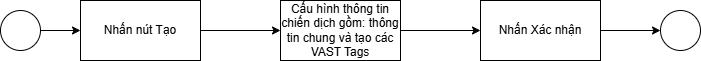
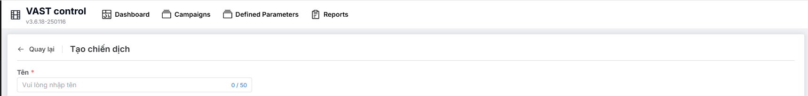
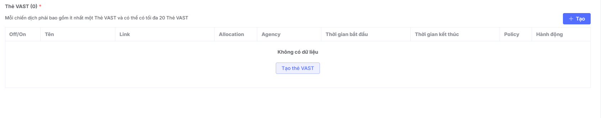
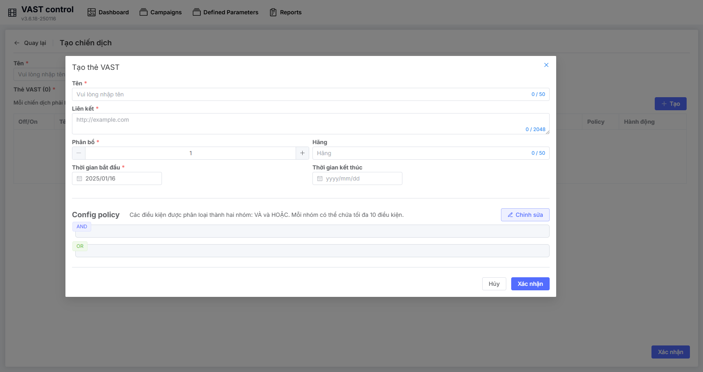
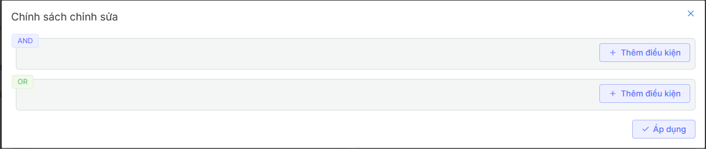
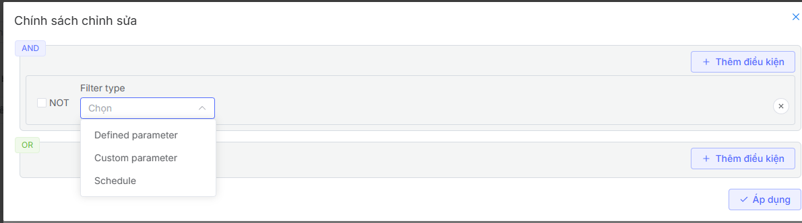
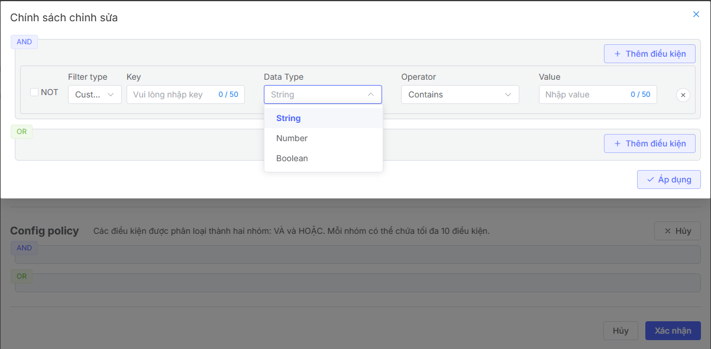
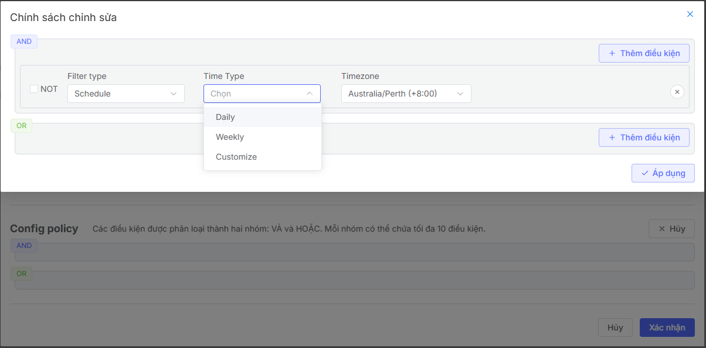
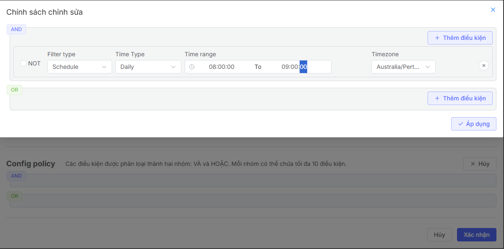
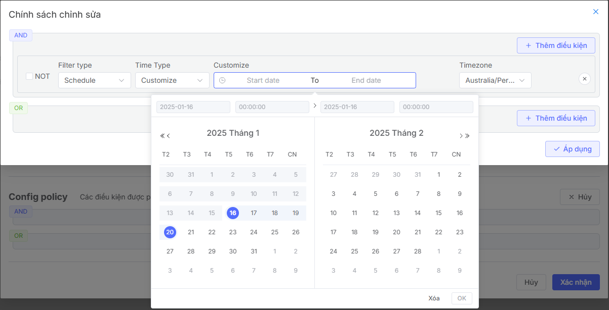

## Create Campaign

## Feature Overview
The campaign creation feature allows you to:

* Set up new campaigns with detailed parameters.
* Manage and monitor campaign performance in real-time.
* Optimize advertising strategy through analytics and reporting tools

## Flow
The campaign creation process that users need to follow

## Create New Campaign
To create a new campaign, users need to initialize a campaign following these steps:

1. Access the Vast Control management page.
2. Display the campaign list page.
3. Click the Create button to start creating a campaign.
4. Navigate to the Create New Campaign page

**Step 1: Enter Campaign Name**

**Step 2: Configure VAST Tags**
1. Click Create or Create VAST Tag to create a new VAST Tag

2. The system displays a pop-up for users to configure VAST Tag information

2.1. Users proceed to configure general VAST Tag information including: Name, Link, Distribution, Agency, Start Time, End Time of VAST Tags

2.2. Users proceed to configure conditions and rules of the VAST Tag by clicking the **Edit** button in the Config Policy section

This conditions and rules section allows users to configure conditions with AND or OR relationships.

2.3. Click Add Condition to configure specific conditions

The system provides 3 types of rules:

**Defined parameter:** Pre-defined parameters that allow users to reuse. See more here
**Custom parameter:** Newly created custom parameters including fields: Key, Data Type, Operator, Value

**Schedule:** Time configuration. There are the following types of time configurations:

**Daily:** Allows users to select a specific time period during the day. For example, if configured to run from 8:00:00 - 9:00:00, the ad will run during the period 8:00:00 - 9:00:00 on all days in the campaign schedule.

**Weekly:** Allows users to select a specific time period on fixed days of the week. For example, if configured to run from 8:00:00 - 9:00:00 on Monday and Wednesday weekly, the ad will run during the period 8:00:00 - 9:00:00 on Monday and Wednesday within the campaign schedule period.

**Customize:** Allows users to select specific ad run times by date and hour

**Step 3:** After creating all VAST Tags, users click **Confirm** to successfully create the campaign 