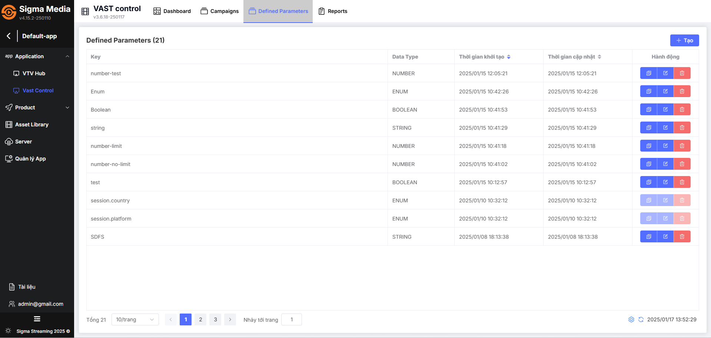
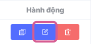
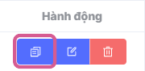
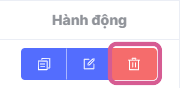

## Defined Parameter List
A **Defined parameter** is a pre-defined value for reuse purposes, helping to save time. It's like setting a "target" or "rule" to ensure everything works according to your preferences.

### View Defined Parameter List
The **defined parameters** list interface is a core part of campaign management, as it provides users with comprehensive control and campaign optimization capabilities. Users can quickly update, check, or modify parameters without searching in different places.

**Step 1:** In the left sidebar menu, move the mouse cursor to **Application** and select **Vast Control**

The system's main screen displays the Dashboard interface (monitoring overview information and metrics related to Vast Control) [See details here](../dashboard.md)

**Step 2:** Select the **Defined Parameters** tab

The screen displays the Defined Parameters list, with main information including:

|Column Name       | Function                                                    |
| -------------- | ------------------------------------------------------------ |
| **Key**         |Parameter name |
| **Data Type**   |Parameter data type        |
| **Creation Time**      | Parameter creation time|
| **Update Time** |Parameter update time|
| **Actions** |**Clone defined parameter:** Allows users to create a new copy of the defined parameter **Edit defined parameter:** Allows users to edit defined parameter information. **Delete defined parameter:** Allows CMS users to delete the defined parameter.

* Other Buttons

|Button Name       | Function                                                    |
| -------------- | ------------------------------------------------------------ |
| **Pagination**         |Bottom left of interface Includes information: Total pages, items per page selection (default 10 items/page), current page, jump to desired search page. |
| **Sync icon**   |Bottom right of interface, performs system synchronization settings:  * Settings for automatic system synchronization (default: auto off)  * Manual system synchronization (by clicking the icon)  * Last system synchronization time        |

## Actions

### Create Defined Parameter
Creating predefined parameters helps you quickly set up advertising campaigns.

[See details here](b-create-defined-parameter.md)

### Edit Defined Parameter
To perform this process, there must be at least one defined parameter previously created and displayed in the list.

**Step 1:** In the list, hover over the **edit** icon in the Actions column at the parameter you want to **edit**, displaying the tooltip text **edit**, click on the icon.

Then displays a pop-up with **defined parameter** configuration information with previously set information. Allows editing all fields.

**Step 2:** Users edit desired information and click the **Save** button

The system displays a **Defined parameter updated successfully** notification in the right corner of the screen, which automatically closes after 5 seconds.

### Clone Defined Parameter
To perform this process, there must be at least one **defined parameter** previously created and displayed in the list.

**Step 1:** In the list, hover over the **clone** icon in the Actions column at the parameter you want to clone, displaying the tooltip text clone, click on the icon.

Then displays a pop-up with defined parameter configuration information with previously set information. Allows editing all fields.

**Step 2:** Users enter necessary information and click the **Save** button

The system displays a **Defined parameter cloned successfully** notification in the right corner of the screen, which automatically closes after 5 seconds.

### Delete Defined Parameter
To perform this process, there must be at least one **defined parameter** previously created and displayed in the list.

**Step 1:** In the list, hover over the **Delete** icon in the Actions column at the parameter you want to Delete, displaying the tooltip text **Delete**, click on the icon.

The system will display a confirmation pop-up window in the center of the screen

**Step 2:** Users click the **Confirm** button to delete defined parameter information

The system displays a **Deleted successfully!** notification in the right corner of the screen, which automatically closes after 5 seconds.

Simultaneously, the system **deletes all defined parameter information** 