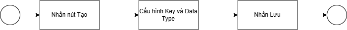
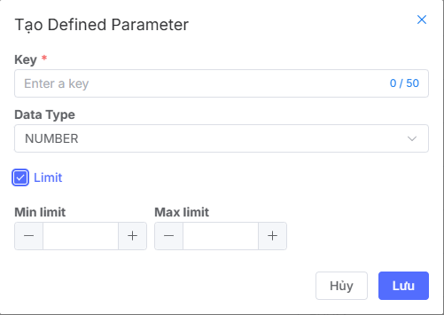

## Create Defined Parameter

### Feature Overview
The defined parameter creation feature allows you to:

* Define parameters with data types and default values
* Customize flexibly according to usage needs
* Apply easily in processes and applications
* Increase efficiency through automation and reduced manual configuration

### Flow
The defined parameter creation process that users need to follow

### Create New Defined Parameter
To create a new **defined parameter**, users need to initialize following these steps:

1. Access the Vast Control management page
2. Go to the defined parameters list screen
3. Click the Create button to start creating a defined parameter
4. Display the create defined parameter pop-up

**Step 1: Enter Key Name**

**Step 2: Set Key Data Type**
Currently, the system supports the following Data types: **String, Number, Boolean, Enum**. Default is **String**. For different Data types, the system will display different configuration forms.

For example, note some special forms like Number → the system allows users to set desired limits by checking the Limit box. When checking the Limit box, the system allows users to enter the minimum and maximum limits of the key value

For **Enum** Data type, the system allows users to configure the list of **enum** values by clicking the **New Value** button. Allows entering up to **20** enum values

**Step 3: Click Save**
After completing the above settings, users click **Save** to complete the Create Defined Parameter process 