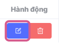
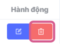

## Report Management
The **report management** feature helps users create, monitor, and manage reports effectively. This function helps optimize workflows and provides timely information to support decision-making.

### View Report List
The interface in the list includes basic information about reports such as report name, report creator, creation time, update time, and allows searching, helping administrators get an overview.

**Step 1:** In the left sidebar menu, move the mouse cursor to **Application** and select **Vast Control**

The system's main screen displays the Dashboard interface (monitoring overview information and metrics related to Vast Control). [See details here](../dashboard.md)

**Step 2:** Select the **Reports** tab

The screen displays the report list, with main information including:

|Column Name       | Function                                                    |
| -------------- | ------------------------------------------------------------ |
| **Name**         |Report name |
| **Owner**   |Displays the email of the report creator       |
| **Creation Time**      | Report creation time|
| **Update Time** |Report update time|
| **Actions** |**Edit report:** Allows users to edit the report. **Delete report:** Allows users to delete the report

* Other Buttons

|Button Name       | Function                                                    |
| -------------- | ------------------------------------------------------------ |
| **"New Report" Button**         |Create a new report |
| **Quick filter**   |Quick filter supporting information search including: report name    |
| **Pagination**   |Bottom left of interface Includes information: Total pages, items per page selection (default 10 items/page), current page, jump to desired search page.    |
| **Sync icon**   |Bottom right of interface, performs system synchronization settings:  * Settings for automatic system synchronization (default: auto off)  * Manual system synchronization (by clicking the icon)  * Last system synchronization time   |

## Actions

### Create Report
The report creation function allows users to design reports according to their needs. Users can select data sources and customize filter criteria.

[See details here](b-create-report.md)

### Edit Report
To perform this process, there must be at least one report previously created and displayed in the list.

Step 1: In the list, hover over the **Edit** icon in the Actions column at the report you want to edit, click on the icon.

The system navigates to the **Report builder** screen

On the **Report builder** screen, users can change report information and then click the **Save** button to update information, or **Save as copy** to create a new report, or **Save and run** to both run the report and update information

After clicking **Save**, the system automatically returns to the report list screen and displays an **Updated successfully** notification in the right corner of the screen, which automatically closes after 5 seconds.

After clicking **Save as copy**, the system automatically returns to the report list screen and displays a **Created successfully** notification in the right corner of the screen, which automatically closes after 5 seconds.

After clicking **Save and run**, the system navigates to the **Recent results** screen and displays an **Updated successfully** notification in the right corner of the screen, which automatically closes after 5 seconds.

### Delete Report
To perform this process, there must be at least one report previously created and displayed in the list.

**Step 1:** In the list, hover over the **Delete** icon in the Actions column at the report you want to delete, click on the icon.

The system will display a confirmation pop-up window in the center of the screen

**Step 2:** Users click the **Agree** button to delete report information

The system displays a **Deleted successfully!** notification in the right corner of the screen, which automatically closes after 5 seconds.

Simultaneously, the system **deletes all report information**

### Run Report
After setting up metrics on the **Report Builder** screen, users click the **Run** or **Save and run** button for the system to export data according to the configured metrics.

On the **Recent Results** screen, users can click the **Export** button to extract information in Excel file format. 