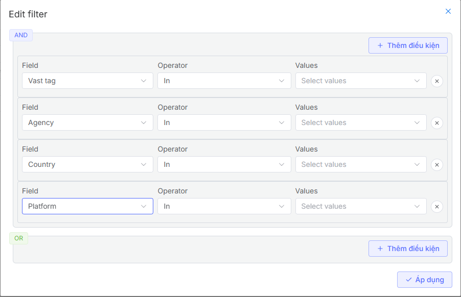
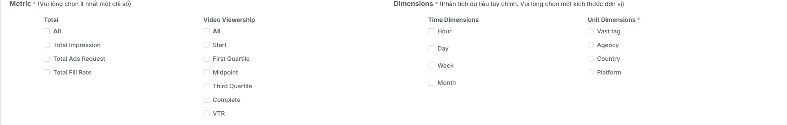

## Create Report
### Feature Overview
The report creation feature allows you to:

* **Customize reports:** Select metrics, filters, break down display data according to needs.
* **Data mining:** Extract information from multiple sources and display it visually.
* **Increase work efficiency:** Reduce data processing time and support quick decision-making.

### Flow
The report creation process that users need to follow

### Create New Report
To create a new report, users need to follow these steps:

1. Access the Vast Control management page.
2. Go to the report list screen
3. Click the **New Report** button to start creating a report
4. Display the Report Builder screen for users to set up parameters as desired

**Step 1: Complete Information Section**

In the information completion section, users need to configure the following information:

* Report name
* Select timezone for report creation
* Select time period for report creation
* Select campaign for report creation. Note that currently, the system only supports creating reports for one campaign at a time
* After selecting the report, users select the necessary parameters for the campaign by clicking the **Filter** button

In this **Filter** section, users can configure parameters by vast tag, agency, country, or platform

**Step 2: Set up Metrics and Dimensions**

Metrics are the parameters users want to report on. Currently, the system allows selecting one or multiple parameters

Dimensions are ways to break down data. There are two types of data breakdown:

Time-based data breakdown. The system supports breaking down data by hour, day, week, month. For each breakdown unit, there are different report time period limits:

* If creating a report broken down by hour, you can only create reports for a maximum of 1 day
* If creating a report broken down by day, you can only create reports for a maximum of 30 days
* If creating a report broken down by week, you can only create reports for a maximum of 3 months
* If creating a report broken down by month, you can only create reports for a maximum of 6 months
* If you don't want to break down data by time, you can create reports for a maximum of 1 year

Size unit-based data breakdown. The system supports breaking down data by the following size units: vast tag, agency, country, platform. If you choose to break down data by any size unit, the system will group data by that size unit.

**Step 3: Click Save or Save and Run to Successfully Create the Report**

After completing the information in **Step 1** and **Step 2**, users have the following options:

* Click **Save**, the system automatically returns to the report list screen and saves the report information that has been set up by the user
* Click **Save and Run**, the system will navigate to the **Recent Results** screen and display report data according to the configured parameters while saving the report information on the report list screen
* Click **Run**, the system will navigate to the **Recent Results** screen and display report data according to the configured parameters, however, the system will not save the report information that has been configured by the user 