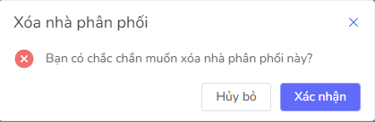

# Xóa nhà phân phối

Đối tượng sử dụng chức năng: Tài khoản CMS được cấp quyền Quản trị viên VTVhub.

**Điều kiện**: Để thực hiện chức năng này, cần phải có ít nhất một nhà phân phối đã được tạo trước đó và hiển thị trong danh sách nhà phân phối.

**Bước 1**:  Truy cập CMS, tại sidebar chọn VTVhub, hiển thị giao diện danh sách nhà phân phối

**Bước 2**: Click nút **Xóa** ở cột Hành động tại nhà phân phối muốn xóa

Hệ thống sẽ hiển thị một cửa sổ pop-up xác nhận ở trung tâm màn hình với các chi tiết sau:

- Tiêu đề: Xoá nhà phân phối
- Nội dung: Bạn có chắc chắn muốn xóa nhà phân phối này?
- Nút **Huỷ bỏ**: Không thực hiện thao tác, quay lại màn hình Danh sách nhà phân phối.
- Nút **Xác nhận**: Hệ thống thực hiện việc xoá toàn bộ thông tin của nhà phân phối.

**Bước 3**: Người dùng nhấn nút **Xác nhận** để xoá thông tin của nhà phân phối. Hệ thống hiển thị một cửa sổ pop-up thông báo ``Xoá nhà phân phối thành công`` ở góc phải màn hình và tự động đóng thông báo sau 5 giây.

Đồng thời, hệ thống thực hiện xoá toàn bộ thông tin của nhà phân phối.

- Lưu ý: Hạn chế sử dụng tính năng này vì khi xóa sẽ không khôi phục lại được
