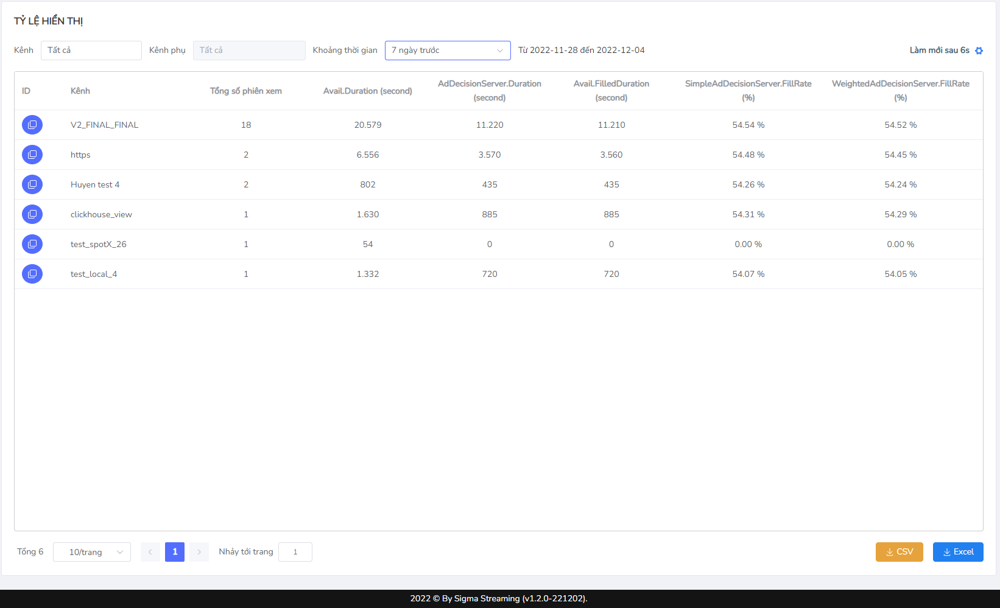

# Tỷ lệ hiển thị
Khi luồng video bắt đầu **chạy qua điểm chèn quảng cáo đầu tiên**, SSAI nhận dữ liệu và hiển thị các thống kê liên quan tới các vấn đề về Fillrate- Tỷ lệ hiển thị( Bao gồm hiển thị thành công và hiển thị không thành công) giúp người dùng có thể giám sát hiệu quả hoạt động quảng cáo, nắm được cơ bản tình trạng để đánh giá và đem ra giải pháp.
**Bước 1:** Tại sidebar, chọn Thống kê
Hiển thị xổ xuống danh sách lựa chọn
**Bước 2:** Người dùng chọn Tỷ lệ hiển thị

Hệ thống hiển thị giao diện Tỷ lệ hiển thị:

* Quick filter: 
    * Kênh: các kênh thuộc danh sách kênh hiện có
    * Kênh phụ: không cho phép chọn kênh phụ trường hợp người dùng chưa chọn kênh cụ thể
    * Khoảng thời gian:hiển thị mặc định Hôm nay, thời gian truy vấn tối đa 3 tháng.
* Icon đồng bộ
* Phân trang
* Nút CSV xuất ra file dưới dạng CSV
* Nút Excel xuất ra file dưới dạng Excel.
* Bảng các chỉ số 