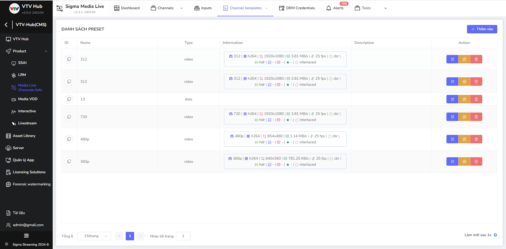

# Xem danh sách preset

Giao diện danh sách preset là một phần quan trọng trong việc quản lí trên hệ thống. Giao diện trong danh sách bao gồm các thông tin cơ bản về preset như ID, tên, loại,...

Trên màn hình chính của Media Live, người dùng trỏ chuột vào Channel templates và chọn tab Preset.

Màn hình chính hệ thống hiển thị giao diện màn hình danh sách preset

Các thông tin chính bao gồm:

| Tên cột       | Chức năng                                                    |
| ------------- | ------------------------------------------------------------ |
| **ID**        | Sau khi người dùng tạo mới preset, hệ thống sinh ra ID riêng cho mỗi preset với mục đích nhận diện. |
| **Tên**       | Tên của preset (do người dùng CMS cấu hình)                  |
| **Loại**      | Loại của preset bao gồm: video, audio và data                |
| **Thông tin** | Bao gồm thông tin đầy đủ chi tiết của preset: `Tên, Codec, Resolution, Bitrate, FPS, CBR, HDR, Pixel format, Scale type, Constant quality, Interlaced mode` |
| **Mô tả**     | Mô tả của preset                                             |
| **Hành động** | ***Tạo bản sao:*** Tạo nhanh 1 bản sao với thông tin bắt buộc được cấu hình sẵn. ***Chỉnh sửa:*** Cho phép người dùng chỉnh sửa các thông tin của đầu vào đã tạo (Transcode/Package) ***Xoá:*** Cho phép người dùng CMS thực hiện xoá đầu vào (Transcode/Package) |

- Các nút khác

| Tên nút             | Chức năng                                                    |
| ------------------- | ------------------------------------------------------------ |
| **Icon đồng bộ**    | Góc phải bên dưới giao diện, luôn thực hiện đồng bộ hệ thống liên tục trong 10s |
| Icon **Phân trang** | Bao gồm các thông tin: Tổng số trang, lựa chọn số items/1 trang (mặc định 10 items/1 trang), trang hiện tại, nhảy tới trang mong muốn tìm kiếm. |

