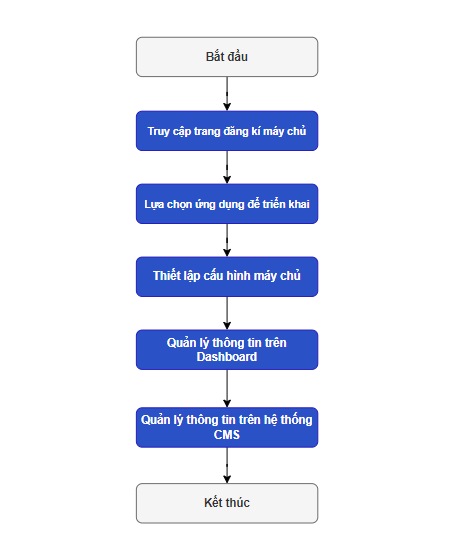

# Hướng dẫn đăng kí máy chủ Sigma Media Server

Cho phép người dùng dễ dàng đăng ký Server sẵn có lên hệ thống Sigma Server dựa trên Registrator Web Browser thông qua các nền tảng Cloud Marketplace như AWS, Google Cloud, Azure, và DigitalOcean

Marketplace cung cấp 2 phiên bản máy cho người dùng đăng ký:

- **Sigma Media Server Free**: Phiên bản miễn phí
- **Sigma Media Server Pro**: Phiên bản Pro

> [!NOTE]
> **Không giới hạn số lượng máy chủ được đăng ký**


## Luồng thực hiện

Để đăng ký Sigma Media Server trên Marketplace, người dùng cần thực hiện theo các bước sau:



## Điều kiện tiên quyết

- Thực hiện [Đăng ký](../../sigma-streaming-platform/02-user-management/a-sign-up.md) hoặc [đăng nhập](../../sigma-streaming-platform/02-user-management/c-sign-in.md) để truy cập vào hệ thống quản lý của ***Sigma Streaming Platform*** tại `https://portal.sigma.video`.
- Người dùng đã hoàn thành quá trình onboarding: [thu thập thông tin], [hướng dẫn sử dụng sản phẩm], [danh sách nhiệm vụ onboard]

## Truy cập trang đăng ký máy chủ

Người dùng sẽ được chuyển hướng từ trang Marketplace hoặc có thể chủ động truy cập thông qua liên kết URL `http://{{VM_IP}}:4000`


với **VM_IP:** Địa chỉ IP của Sigma Media Server


Hệ thống hiển thị màn hình Đăng ký máy chủ với thông tin liên quan như **thông tin máy chủ (Server Info), thông tin giấy phép (License Info)** và **thông tin đăng ký máy chủ (Registration Info)**.


Với các chi tiết sau:

- **Nút "Đăng ký máy chủ"**: Thực hiện đăng ký máy chủ

| **Thông tin máy chủ** | **Mô tả**                                 |
| --------------------- | ----------------------------------------- |
| **Loại**              | Loại máy chủ - **Sigma Media Server Pro** |
| **Trạng thái**        | Trạng thái máy chủ                        |
| **Hệ điều hành**      | Hệ điều hành của máy cục bộ               |
| **Địa chỉ IP**        | Địa chỉ IP của máy chủ                    |
| **Cổng**              | Cổng máy chủ                              |
| Mức sử dụng RAM       | RAM của máy chủ                           |
| **Mức sử dụng CPU**   | CPU của máy chủ                           |
| **GPU sử dụng**       | GPU của máy chủ                           |
| **Phiên bản**         | Phiên bản máy chủ                         |

| **Thông tin giấy phép**  | **Mô tả**                                       |
| ------------------------ | ----------------------------------------------- |
| **Mã giấy phép**         | Mã kích hoạt giấy phép cho việc sử dụng máy chủ |
| **Trạng thái giấy phép** | Trạng thái của giấy phép được gán cho máy chủ   |

| **Thông tin đăng ký** | **Mô tả**                  |
| --------------------- | -------------------------- |
| **Tên**               | Tên máy chủ                |
| **ID Ứng dụng**       | ID của ứng dụng đã đăng ký |
| **Ingest App**        | Cấu hình ứng dụng Ingest   |
| **Origin App**        | Cấu hình ứng dụng Origin   |

**Cài đặt Nâng cao **bao gồm: **Storage**, **Metrics** và **Log**

| Storage               | **Mô tả**                                                    |
| --------------------- | ------------------------------------------------------------ |
| **Data Dir**          | Thông tin đường dẫn lưu trữ cho luồng Live                   |
| **Expire (s)**        | Thời gian lưu trữ cho luồng Trực tiếp (giây)                 |
| **Scanning time (s)** | Thời gian quét định kỳ ổ đĩa lưu trữ (giây) cho Luồng Live   |
| **Catchup Dir**       | Thông tin đường dẫn lưu trữ cho luồng Catchup                |
| **Expire (s)**        | Thời gian lưu trữ cho luồng Catchup (giây)                   |
| **Scanning time (s)** | Thời gian quét định kỳ ổ đĩa lưu trữ (giây) cho Luồng Catchup |

| Metrics               | **Description**                                     |
| --------------------- | --------------------------------------------------- |
| **Storage Data Path** | Thông tin về đường dẫn lưu trữ của thước đo dữ liệu |
| Retention (day)       | Thời gian lưu trữ cho data metrics                  |

| **Log**             | **Mô tả**                                   |
| ------------------- | ------------------------------------------- |
| **Đường dẫn Log**   | Thông tin đường dẫn lưu trữ Log của máy chủ |
| **Hết hạn (ngày)**  | Thời gian lưu trữ Log (ngày)                |
| **File quay**       | Số lượng file quay                          |
| **Kích thước (MB)** | Kích thước tệp                              |

## Lựa chọn ứng dụng

Để cài đặt máy chủ, người dùng có thể chọn ứng dụng từ danh sách ứng dụng (nếu đã có ứng dụng) hoặc [tạo một ứng dụng mới](../04-getting-started/02-create-application.md) (nếu chưa có ứng dụng nào).


**Bước 1**: Trên [server registration page](#access-the-server-registration-page), nhấp vào nút “**Đăng ký máy chủ**”


Hệ thống hiển thị màn hình danh sách ứng dụng.


**Bước 2:** Người dùng tiếp tục chọn một ứng dụng để cài đặt máy chủ

Hệ thống tự động chuyển tiếp đến bước Thiết lập máy chủ.


## **Thiết lập máy chủ**

Cấu hình các tùy chọn để triển khai máy chủ vào hệ thống Sigma Media với ứng dụng được chọn.

**Bước 1:** Sau khi [chọn ứng dụng](#select-application) or [tạo một ứng dụng mới](../04-getting-started/02-create-application.md), hệ thống điều hướng đến màn hình Thiết lập máy chủ


Với các thông tin chi tiết sau:

- **Loại máy chủ:** Đăng ký mặc định cho Sigma Media Server Pro.

- **Tên máy chủ:** Bắt buộc, không hỗ trợ ký tự có dấu, không chứa khoảng trắng

- **Cấu hình Mạng:** Nhập hoặc chọn địa chỉ IP/ tên miền, hệ thống tự động tạo dữ liệu cho ***RTMP Public URI, SRT Public URI, Web RTC Public URI, HTTP Public URI***

- Cài đặt Nâng cao bao gồm:

  - **Ứng dụng Ingest:** Mặc định là ***kích hoạt***, cho phép người dùng bật/tắt cấu hình ứng dụng Ingest

  - **Ứng dụng Origin:** Mặc định là ***kích hoạt***, cho phép người dùng bật/tắt cấu hình ứng dụng Origin

  - Đường dẫn log: Cho phép nhập hoặc chọn (nhấp vào nút "Chọn"), giá trị mặc định: 

    ```
    /var/log/sigma-machine
    ```

    - **Hết hạn (ngày)**: giá trị mặc định: 7, giá trị tối thiểu-tối đa: 1-360
    - **File quay**: giá trị mặc định: 10, giá trị tối thiểu-tối đa: 1-100
    - **Kích thước (MB)**: giá trị mặc định: 50, giá trị tối thiểu-tối đa: 10-1024

  - Thư mục Dữ liệu: Cho phép nhập hoặc chọn (nhấp vào nút "Chọn"), giá trị mặc định: 

    ```
    /data/transcode
    ```

    - **Hết hạn (s)**: giá trị mặc định: 604 800, giá trị tối thiểu-tối đa: 10-31104000
    - **Thời gian quét (s)**: giá trị mặc định: 360, giá trị tối thiểu-tối đa: 10-31104000

  - Thư mục Catchup: Cho phép nhập hoặc chọn (nhấp vào nút "Chọn"), giá trị mặc định: 

    ```
    /data/transcode
    ```

    - **Hết hạn (s)**: giá trị mặc định: 604 800, giá trị tối thiểu-tối đa: 10-31104000
    - **Thời gian quét (s)**: giá trị mặc định: 360, giá trị tối thiểu-tối đa: 10-31104000

  - Đường dẫn Dữ liệu Lưu trữ: Cho phép nhập hoặc chọn (nhấp vào nút "Chọn"), giá trị mặc định: 

    ```
    /etc/sigma-machine/apps/victoria-metrics/victoria-metrics-data
    ```

    - **Lưu giữ (ngày)**: giá trị mặc định: 7, giá trị tối thiểu-tối đa: 1-90

- **Nút “Xác nhận”:** Xác nhận triển khai máy chủ

**Bước 2:** Người dùng điền thông tin bắt buộc và điều chỉnh cài đặt cấu hình máy chủ.

**Bước 3:** Sau khi hoàn tất, người dùng nhấp vào nút **“Gửi"**. Hệ thống hiển thị một cửa sổ pop-up xác nhận, yêu cầu xác nhận triển khai máy chủ


**Bước 4:** Người dùng xác nhận triển khai bằng cách nhấp vào nút "Có”.

Hệ thống hiển thị màn hình thông báo chỉ ra việc triển khai thành công.


- **Button “Done”:** The system navigates to the [Dashboard](#view-information-on-the-dashboard) screen with the successfully registered information.

- **Text button “Go to Sigma Portal”:** The system opens the [Server management](#view-server-information-on-the-cms) screen (CMS) with the newly registered application.

## Manage information on the Dashboard 

After successfully deploying the server, users can manage registration information at the Dashboard Web UI.


### View information on the Dashboard

Continuing from step 4 of the [Set up server](#set-up-server), user clicks button **“Done”** or can access via the URL link `http://{{VM_IP}}:4000/`

The system displays the Sigma Registration screen with with the successfully registered information such as **Server Info, License Info, Registration Info.**


With the following detailed information:

- **Server Info** includes Type, Status, Operating System, IPAddress, Port, Ram Usage, CPU Usage, GPU Usage and Version [(see more details)](#access-the-server-registration-page)

- **License info**  includes License Code and License Status [(see more details)](#access-the-server-registration-page)
- **Registration Info** includes Name, App ID, Ingest App and Origin App [(see more details)](#access-the-server-registration-page)
- **Advanced Settings** includes Storage, Metrics, Log [(see more details)](#access-the-server-registration-page)
- **Button “Edit”**: To perform the action of [updating server configuration](#update-server-configuration).
- **Button “Re-Register Server”**: To re-register the server.
- **Button “App Editor”**: The system opens the Sigma Portal screen with the newly registered application. [(see more details)](#manage-information-on-the-cms)


### Update server configuration

> [!NOTE]
> When performing this action, jobs may experience interruptions or cease operation

**Step 1:** On the Dashboard of successful server registration page, user clicks button **“Edit”**


The system displays editable fields for information modification [(see more details)](#set-up-server)


**Step 2:** User input mandatory information.

**Step 3:** After completion, the user clicks button **“Save”**. 

The system saves the new information for the server configuration, displaying the updated information on the screen.


## Manage information on the CMS

After successfully deploying the server, user can manage information related to the newly registered server such as server details, server license, etc

### View server information on the CMS

Continuing from **step 4** of the [Set up server](#set-up-server), user clicks button “Go to Sigma Portal” or clicks button “App Editor” on the [Dashboard](#view-information-on-the-dashboard)

The system displays the Server list screen of the application (CMS) with information about servers registered from the marketplace marked with the following details:


- **Server type:** Pro
- **Server status:** Running


### **View license information on the CMS**

Continuing from **step 4** of the [Set up server](#set-up-server), user clicks button “Go to Sigma Portal” or clicks button “App Editor” on the [Dashboard](#view-information-on-the-dashboard)


The system displays the Server list screen of the application (CMS), choose **License tab**


The system displays the License List screen of the application, with information about servers registered from the marketplace marked with the following details:

.png>)

- **License type:** Marketplace Server
- **Status:** Used
- **Server use:** corresponding server
- **Expiration date:** unlimited
- **And does not allow performing actions for Marketplace server licenses.**