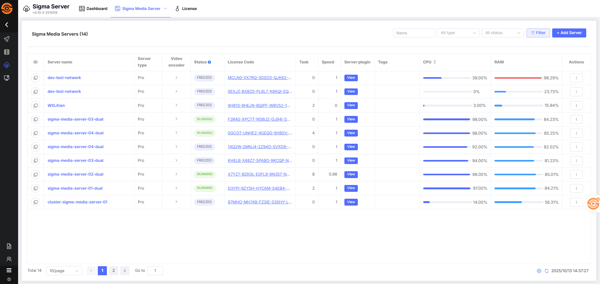
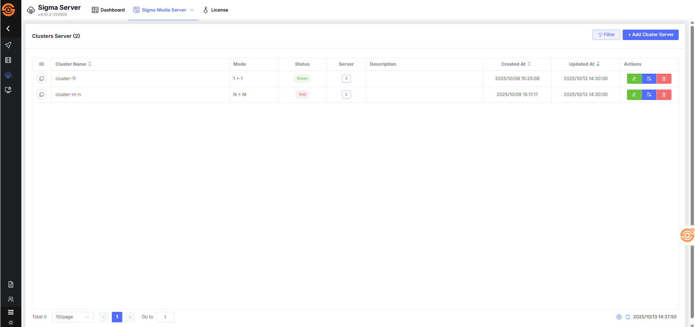

# Bắt đầu với Sigma Media Server

Sigma Media Server là một phần mềm cho phép bạn quản lý và phát trực tiếp nội dung đa phương tiện. Nó hỗ trợ nhiều định dạng video và âm thanh, cũng như các tính năng phát trực tiếp và ghi hình.


## Luồng thực hiện 

Để bắt đầu nhanh chóng làm quen với Sigma Media Server, người dùng cần thực hiện các bước sau:


## Bước 1: Truy cập vào hệ thống Sigma Streaming

1. Thực hiện [Đăng kí tài khoản](../../sigma-streaming-platform/02-user-management/a-sign-up.md) hoặc [đăng nhập](../../sigma-streaming-platform/02-user-management/c-sign-in.md) để truy cập hệ thống quản lý của **Sigma Streaming Platform** `https://portal.sigma.video`
2. Hiển thị Danh sách ứng dụng, **chọn ứng dụng** cần truy cập.
3. Hiển thị mặc định vào trang **tổng quan ứng dụng**.


## Bước 2: Lấy mã token để thực hiện đăng kí máy

1. Tại sidebar, chọn mục **Server**
2. Hiển thị danh sách máy chủ, **chọn thêm máy chủ**, chọn tab **"On premise"**
3. Hiển thị thông tin cài đặt máy, trong đó bao gồm ***Registation Token***
4. Sao chép `Registation Token` và thực hiện cài máy trên máy (local)

Ngoài ra, người dùng có thể thực hiện thao tác "Đổi mã đăng ký"


## Bước 3: Cài đặt Sigma Media Server

> [!NOTE]
> Các bước cài đặt có thể thay đổi tùy theo phiên bản hệ điều hành của bạn. Vui lòng đảm bảo rằng bạn có quyền root hoặc sudo để thực hiện các bước cài đặt.

> [!TIP]
> Bạn có thể sử dụng các công cụ quản lý container như Docker Compose để quản lý container Sigma Media Server dễ dàng hơn. Bạn có thể cấu hình Sigma Media Server để sử dụng bộ nhớ cache để cải thiện hiệu suất.


Trước tiên, bạn cần tải xuống và cài đặt Sigma Media Server bằng cách chạy các lệnh sau trong terminal:

- Cài đặt trên CentOS

```bash
# Tải file cấu hình kho phần mềm
sudo wget https://repo.sigma.video/centos/sigma-media-server.repo -O /etc/yum.repos.d/media-server.repo  

# Hoặc sử dụng curl thay thế
curl -s https://repo.sigma.video/centos/sigma-transcoder.repo | sudo tee /etc/yum.repos.d/sigma-transcoder.repo > /dev/null  

# Cài đặt Sigma Media Server
yum install sigma-media-server  
```

- Cài đặt trên Ubuntu

```bash
# Tải file cấu hình kho phần mềm
wget https://repo.sigma.video/debian/sigma-media-server.list -O /etc/apt/sources.list.d/sigma-media-server.list  

# Cập nhật danh sách gói
sudo apt-get update  

# Cài đặt Sigma Media Server
sudo apt-get install sigma-media-server  
```

- Cài đặt trên Docker
```bash
coming soon
```
## Bước 4: Khởi động dịch vụ Sigma Media Server

Sau khi cài đặt thành công, hãy khởi động dịch vụ Sigma Media Server bằng lệnh sau:

```bash
sudo systemctl start sigma-media-server  
```

## Bước 5: Đăng kí máy chủ

Cho phép người dùng thực hiện đăng kí máy chủ thông qua 2 cách

- Đăng kí máy chủ qua Marketplace: [Xem chi tiết tại đây](/docs/vi/sigma-media-server/04-getting-started/c-register-server-on-marketplace.md)
- Đăng kí máy chủ qua Script

Sử dụng mã đăng ký để thực hiện đăng kí máy chủ qua script sau:

```bash
/etc/sigma-machine/script/register.sh --server-name=live-server-83 --enable-origin=true --enable-ingest=true --server-token=xamBWB0CZpXgI9VXkP68c --server-data-dir=/data/transcode
```

Trong đó: 

```bash
Usage: /etc/sigma-machine/script/register.sh [OPTIONS]

Options:
  -sn, --server-name=VALUE       Your server name (required)
  -st, --server-token=VALUE      Token get from portal server add page (required)
  -eo, --enable-origin=VALUE     Enable or disable origin server (port 8080 for http streaming hls, dash) (default true)
  -ei, --enable-ingest=VALUE     Enable or disable ingest server for incomming streaming(port 1935 for rtmp, rtsp, srt) (default true)
  -sd, --server-data-dir=VALUE   Set your data dir save data (default /data/transcode)
  -ae, --api-endpoint=VALUE      API endpoint for register server (default https://api.sigma.video)

Example:
  /etc/sigma-machine/script/.sh --server-name=live-server-01 --enable-origin=true --enable-ingest=true --server-token=kKLyAqeQlcWImVciTrWW- --server-data-dir=/data/transcode
```


## Bước 6: Thêm giấy phép hoạt động cho máy chủ 

Sau khi thực hiện cài đặt máy thành công, người dùng có thể quản lý máy trên hệ thống Sigma CMS. Trước khi máy có thể hoạt động, người dùng cần thực hiện thêm giấy phép khả dụng cho máy.

***Người dùng bỏ qua bước này nếu ở Bước 5 thực hiện đăng kí máy chủ qua Marketplace***

Với việc thêm giấy phép người dùng có thể thực hiện bằng 2 cách:

- Truy cập vào phần Quản lý giấy phép: [Xem chi tiết tại đây]()
- Truy cập vào phần Quản lý máy chủ: [Xem chi tiết tại đây]()

## Bước 7: Quản lý máy chủ

Mỗi loại máy chủ sẽ được quản lý trên một giao diện riêng biệt. Ngoài ra, hệ thống cũng cung cấp cho người dùng giao diện để quản lý toàn bộ giấy phép của ứng dụng và phần Giám sát hiệu suất hoạt động của toàn bộ máy chủ.

[Xem chi tiết tại đây]()




Các hành động được thực hiện với máy chủ:

- Xem thông tin chi tiết máy chủ:  [Xem chi tiết tại đây]()

- Thêm giấy phép: [Xem chi tiết tại đây]()
- Đẩy job: [Xem chi tiết tại đây]()
- Khôi phục: [Xem chi tiết tại đây]()
- Unfreeze: [Xem chi tiết tại đây]()
- Tạm dừng: [Xem chi tiết tại đây]()
- Tiếp tục hoạt động: [Xem chi tiết tại đây]()
- Config route: [Xem chi tiết tại đây]()
- Cập nhật metadata: [Xem chi tiết tại đây]()
- Xem bản ghi: [Xem chi tiết tại đây]()
- Xóa: [Xem chi tiết tại đây]()


## Bước 8: Quản lý cụm máy chủ

Việc tạo những Cluster Server giúp người dùng có thể gộp các máy lại với nhau thành một cụm, giúp cho việc hỗ trợ nhau xử lý các task giữa các máy trở nên dễ dàng hơn. Cụ thể, các máy được gộp lại có thể hỗ trợ nhau trong trường hợp có máy bị chết hoặc gặp sự cố.

Giúp cải thiện tốc độ và hiệu suất làm việc, đồng thời giảm thiểu rủi ro mất mát dữ liệu và đảm bảo sự liên tục của các quy trình xử lý Job.

[Xem chi tiết tại đây]()




Các hành động được thực hiện với máy chủ:

- Tạo mới cụm máy chủ [Xem chi tiết tại đây]()

- Chỉnh sửa cụm máy chủ [Xem chi tiết tại đây]()
- Xem bản ghi: [Xem chi tiết tại đây]()
- Xóa: [Xem chi tiết tại đây]()
