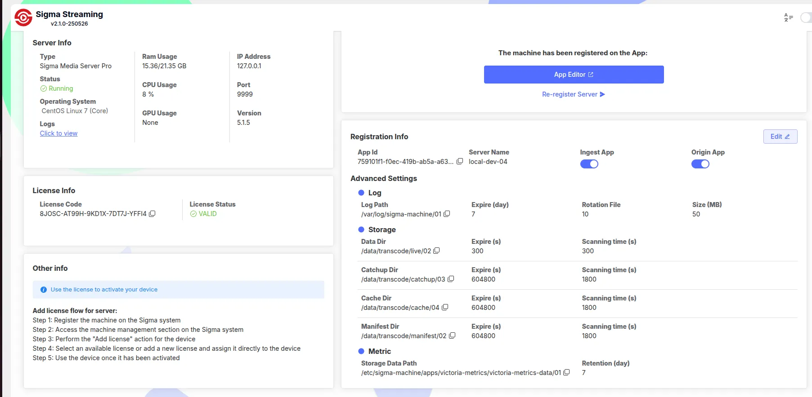
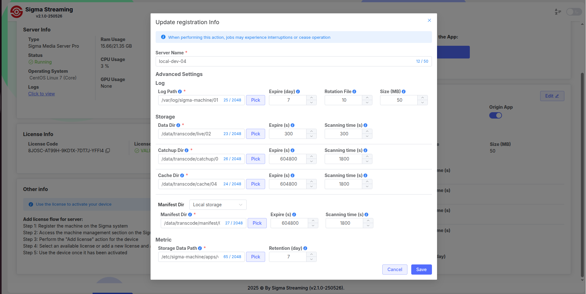

---

title: Hướng Dẫn Cấu Hình Manifest Dir Trong Sigma Media Server
order: 1
---
# Hướng Dẫn Cấu Hình Manifest Dir Trong Sigma Media Server

## 1. Giới Thiệu

`Manifest Dir` là nơi Sigma Media Server **đọc và ghi manifest file** phục vụ streaming (HLS/DASH).

Hệ thống hỗ trợ nhiều loại storage, cho phép linh hoạt lựa chọn theo nhu cầu:

- **Local**: Đọc, ghi trực tiếp trên disk của server.
- **S3**:  Đọc, ghi trên dịch vụ object storage (Amazon S3, MinIO, Ceph).
- **HTTP**:  Đọc, ghi và đọc từ một server HTTP/HTTPS.
- **Redis (Single/Cluster/Sentinel)**:  Đọc, ghi trên Redis , độ trễ thấp, hỗ trợ scale và HA.

---

## 2. Truy Cập Trang Cấu Hình

1. *Mở trình duyệt và truy cập:*
    
    `http://<ip-của-bạn>:8019`
    
    
    

 2. Chọn loại lưu trữ Manifest Dir

     Trong cửa sổ **Update registration Info**, kéo xuống phần **Manifest Dir**.

     Ở ô lựa chọn (dropdown), bạn sẽ thấy 2 tùy chọn:

- **Default (local path)**:
    - Manifest sẽ được lưu trực tiếp trên **ổ đĩa cục bộ** của Sigma Media Server.
    - Thường dùng cho môi trường **dev/test** hoặc khi không cần phân tán.
- **Third-party storage**:
    - Cho phép cấu hình các storage ngoài như **S3, HTTP, Redis (single, cluster, sentinel)**.
    - Phù hợp cho môi trường **production**, khi cần **HA, scalability**

 **

  

*3 .Sau khi chỉnh sửa xong, nhấn **Save** để lưu cấu hình và áp dụng nâng cấp.*

---

## 3. Cấu Hình Theo Loại Storage

### 3.1. Local Storage

- **Mục đích**:  Đọc, ghi manifest ngay trên disk server.

**Ví dụ JSON:**

```json
{
  "type": "fs",
  "fs": {
    "data_dir": "/data/transcode"
  }
}

```

---

**Giải thích tham số**:

- `type`: loại storage, ở đây là `fs`.
- `fs.data_dir`: đường dẫn thư mục trên disk server để lưu manifest.

### 3.2. S3 Storage

- **Mục đích**:  Đọc, ghi manifest trên dịch vụ object storage.

**Ví dụ JSON:**

```json
{
  "type": "s3",
  "s3": {
    "bucket": "my-manifest-bucket",
    "region": "ap-southeast-1",
    "access_key": "AKIAEXAMPLE",
    "secret_key": "abcd1234example",
    "host": "s3.example.com",
    "port": 9000,
    "use_ssl": true}
}

```

---

**Giải thích tham số**:

- `type`: loại storage là `s3`.
- `s3.bucket`: tên bucket chứa manifest.
- `s3.region`: region (địa lý) của bucket.
- `s3.access_key`: access key (API key) để kết nối.
- `s3.secret_key`: secret key tương ứng.
- `s3.host`: endpoint S3 (AWS hoặc S3-compatible).
- `s3.port`: cổng dịch vụ S3 (thường `443` với SSL, `80` nếu không SSL).
- `s3.use_ssl`: `true/false`, bật HTTPS hay không.

### 3.3. HTTP Storage

- **Mục đích**:  Đọc, ghi manifest trên một server HTTP/HTTPS.

**Ví dụ JSON:**

```json
{
  "type": "http",
  "http": {
    "base_path": "https://cdn.example.com/manifests/"
  }
}

```

---

**Giải thích tham số**:

- `type`: loại storage là `http`.
- `http.base_path`: URL gốc nơi lưu các manifest.

### 3.4. Redis (Single Node)

- **Mục đích**:  Đọc, ghi manifest trong Redis key-value store.

**Ví dụ JSON:**

```json
{
  "type": "redis",
  "redis": {
    "uri": "localhost:6379"
  }
}

```

---

**Giải thích tham số**:

- `type`: loại storage là `redis`.
- `redis.uri`: địa chỉ Redis server (host:port).

### 3.5. Redis Cluster

- **Mục đích**: Phân tán dữ liệu manifest trên nhiều node Redis Cluster.

**Ví dụ JSON:**

```json
{
  "type": "redis",
  "redis": {
    "clusters": [
      { "host": "10.0.1.1", "port": 6379 },
      { "host": "10.0.1.2", "port": 6379 },
      { "host": "10.0.1.3", "port": 6379 }
    ],
    "user_name": "clusterUser",
    "password": "clusterPass",
    "pool_size": 30,
    "use_pipeline": false
    }
}

```

---

**Giải thích tham số**:

- `redis.clusters`: danh sách node trong Redis Cluster.
- `redis.user_name`: user để xác thực với cluster (nếu bật ACL).
- `redis.password`: password để xác thực.
- `redis.pool_size`: số kết nối trong pool.
- `redis.use_pipeline`: bật/tắt pipeline (nhiều lệnh gộp 1 round-trip).

### 3.6. Redis Sentinel

- **Mục đích**: Đọc, ghi trên  Redis Sentinel .

**Ví dụ JSON:**

```json
{
  "type": "redis",
  "redis": {
    "sentinels": [
      { "host": "10.0.0.1", "port": 26379 },
      { "host": "10.0.0.2", "port": 26379 },
      { "host": "10.0.0.3", "port": 26379 }
    ],
    "sentinel_username": "sentinelUser",
    "sentinel_password": "sentinelPass",
    "name": "mymaster",
    "user_name": "appUser",
    "password": "redisPass",
    "pool_size": 20
  }
}

```

---

**Giải thích tham số**:

- `redis.sentinels`: danh sách Sentinel (host:port).
- `redis.name`: tên master group (ví dụ: `mymaster`).
- `redis.sentinel_username`: user để xác thực Sentinel.
- `redis.sentinel_password`: password để xác thực Sentinel.
- `redis.user_name`: user để kết nối Redis Master/Slave.
- `redis.password`: password cho user Redis.
- `redis.pool_size`: số kết nối trong connection pool.
- `redis.use_pipeline`: bật pipeline để tăng tốc ghi/đọc nhiều lệnh.

## 4. Kiểm Tra

Gửi file master HLS với nội dung cơ bản (`#EXTM3U`, `#EXT-X-VERSION:4`) lên server qua API.

```
# PUT file master.m3u8 lên server
curl -X PUT "http://127.0.0.1:8081/manifest/test/master.m3u8" \
  -H "Content-Type: application/vnd.apple.mpegurl" \
  --data-binary $'#EXTM3U\n#EXT-X-VERSION:4\n'

# Response từ server
{"message":"ok"}
```

---

---
