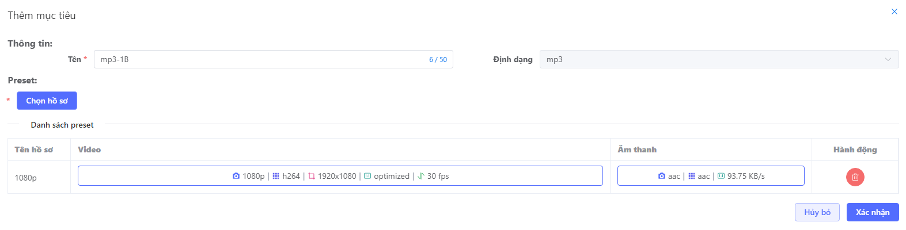

# Tạo mới job VOD

Để tạo mới một video VOD, người dùng cần khởi tạo một công việc mới (job) theo các bước sau:

1. Truy cập vào trang quản lý Video on Demand (VOD).
2. Hiển thị trang danh sách các công việc mặc định.
3. Click vào nút "Thêm mới" để bắt đầu tạo công việc.
4. Chuyển đến trang Tạo mới Job.

## Bước 1: Chọn máy chủ

Trong phạm vi sử dụng máy chủ và không sử dụng dịch vụ đám mây (cloud). Người dùng cần chọn máy chủ để thực hiện công việc.


Sau khi chọn máy chủ, đánh dấu máy chủ được chọn và hiển thị bước thứ 2.

## Bước 2: Tạo đầu vào
Trong quy trình chuyển mã video của luồng tạo mới một công việc (job) để xử lý video, đầu vào (video VOD) là nguồn video gốc cần xử lý. Định dạng của đầu vào có thể là MP4 (MPEG-4), MP3 (MPEG-3), HLS (HTTP Live Streaming) hoặc DASH (Dynamic Adaptive Streaming over HTTP).


Các tùy chọn đầu vào được hỗ trợ bao gồm:


- Chọn file từ máy khách (local): hiển thị pop-up các file trong máy khách (local) khi click vào lựa chọn
    - Hiển thị thông tin liên quan về file như tên file, định dạng, kích thước, và thời gian tạo hoặc chỉnh sửa gần nhất.
    - Không giới hạn kích thước file.
    - Chỉ chọn 1 file với các định dạng phổ biến như tệp âm thanh (MP3) hoặc tệp video (MP4). Và đánh dấu file đang chọn.


- Chọn asset từ thư viện: hiển thị cửa sổ lựa chọn asset từ thư viện của hệ thống.
    - **Loại asset**: audio và video
    - **Thông tin cơ bản**: tên, định dạng, thời lượng và hình ảnh đại diện được hiển thị.
    - Có thể tìm kiếm và lọc
    - Người dùng có thể xem trước asset trước khi chọn làm đầu vào giúp người dùng đảm bảo rằng họ chọn đúng asset phù hợp với nhu cầu của mình.


- Cung cấp một đường dẫn từ bên thứ ba: sau khi nhập đưỡng dẫn hợp lệ, hiển thị đường dẫn, hover hiển thị thông tin cơ bản: 
    - **Type**: Video/audio
    - **Media container formats**: MPEG-4 (MP4), QuickTime Movie (MOV),…
    - **Codec**: H265, H264, AV1, VP9, VP8
    - **Bitrate**: tốc độ dữ liệu của một luồng âm thanh hoặc video.
    - **Resulotion**: Width x Height
    - **FPS**: số lượng khung hình (frames) được hiển thị trong mỗi giây khi phát lại một video.

- Sử dụng video mẫu có sẵn trong hệ thống: mặc định mặc định VOD đầu tiên. Các thông tin của video mẫu:
    - **Tên video**
    - **Resulotion**: Width x Height
    - **FPS**: số lượng khung hình (frames) được hiển thị trong mỗi giây khi phát lại một video.
    - **Codec**: H265, H264, AV1, VP9, VP8

Sau khi người dùng đã lựa chọn đầu vào, hệ thống quay trở lại màn hình tạo mới để thực hiện các bước tiếp theo. Hệ thống đánh dấu loại đầu vào, các tùy chọn không được chọn sẽ tự động ẩn đi.

## Bước 3: Chọn đầu ra( destination)

Tiếp theo, người dùng sẽ được dẫn sang bước tiếp theo trong quá trình, chọn điểm đích (destination) để lưu trữ job VOD. 


Hỗ trợ các luồng đầu ra:

- Lưu vào folder ở máy chủ
    - Hiển thị thông tin về folder như tên folder, định dạng, kích thước, và thời gian chỉnh sửa gần nhất.
    - Không giới hạn kích thước folder.

- Lưu vào bên thứ 3: hỗ trợ FTP, Generic S3
    - Mặc định hiển thị ở FTP với các thông tin:
        - **Host**: địa chỉ IP.
        - **Port**: với máy sử dụng nhiều dịch vụ, port để phân biệt chúng.
        - **Username**: Tên tài khoản đăng nhập.
        - **Password**: mật khẩu đăng nhập.
    - Chuyển tab sang Generic S3:
        - **Bucket name**: Tên của thùng( bucket) chứa các tệp.
        - **Endpoint**: URL endpoint để truy cập vào S3.
        - **Access key ID**: ID Khóa truy cập (tên người dùng) cho phép truy cập vào S3
        - **Secret access key**: Mật khẩu được liên kết với ID khóa truy cập( Access key ID) cho phép truy cập vào S3.
        - **Region**: vị trí lưu trữ trung tâm dữ liệu.
        - **Public permission**.

Sau khi người dùng đã lựa chọn đầu ra, hệ thống quay trở lại màn hình tạo mới để thực hiện các bước tiếp theo. Hệ thống đánh dấu loại đầu ra. Cho phép chỉnh sửa hoặc xoá lựa chọn.

## Bước 4: Cấu hình job

Tiếp theo, người dùng sẽ được dẫn sang bước cuối cùng trong quá trình, cấu hình thông tin job. 

Hiển thị mặc định là danh sách các profile với trạng thái chưa áp dụng bất kỳ mẫu (template) nào. Nút Tạo công việc (Create job) không thể sử dụng.


- Cấu hình profile chung: Chưa có dữ liệu.
- Per-Title Encoding: đang tắt,  tính năng làm giảm kích thước tệp bằng cách tối ưu hóa từng khung hình mà không làm giảm chất lượng video, giúp cải thiện 70% thời gian tải cũng như giảm chi phí lưu trữ và băng thông.
- Nút ``cấu hình mặc định``: xoá data do người dùng cấu hình profile, hiển thị prodile mặc định
- Danh sách profile mặc định gồm: 1080, 720, 480, 360, 240, 144
( cho phép sửa, xoá.)
- Cấu hình mục tiêu

### Chọn cấu hình mẫu
Để tiết kiệm thời gian, người dùng có thể lựa chọn một trong những mẫu cấu hình có sẵn. Điều này giúp tối ưu hóa quy trình và tạo ra các công việc hoặc tác vụ dễ dàng và hiệu quả hơn.

1. Nhấp vào nút `áp dụng với mẫu`
2. Hiển thị danh sách mẫu:


3. Sau khi áp dụng mẫu, hiển thị tên mẫu và cấu hình hiện tại sẽ được thay thế bằng dữ liệu mẫu. Chỉ lấy thông tin từ mẫu, người dùng vẫn có thể custom cấu hình.


Đồng thời, hệ thống hiển thị bước Tạo job
- Nút `Tạo job`: hoàn thành quá trình tạo công việc
- Nút ``Lưu mẫu``: Lưu lại cấu hình thành mẫu mới.

### Tuỳ chỉnh cấu hình 

Người dùng mong muốn có khả năng tùy chỉnh và tạo mới thông tin cho chính họ. Thực hiện các cấu hình theo thứ tự sau:

1.  Kích hoạt Per-title encoding: Bằng cách này, thông tin về hồ sơ bitrate loại video mặc định hiển thị ``optimized``, giúp tối ưu hóa chất lượng video và kích thước file của từng video cụ thể.

2. ử dụng các hồ sơ hợp lý: Người dùng có thể tạo và quản lý tối đa 10 hồ sơ:

- Sử dụng các hồ sơ mẫu có sẵn.
- Chỉnh sửa các hồ sơ mẫu: Bằng cách nhấp vào biểu tượng ``sửa`` đổi trong cột hành động và tiến hành chỉnh sửa theo [hướng dẫn sửa profile](../../../sigma-media-live/05-user-guide/h-profile/3-edit-profile.md).
- Tạo hồ sơ mới theo ý muốn: Bằng cách nhấp vào nút ``thêm hồ sơ``và thực hiện các bước theo [hướng dẫn tạo profile](../../../sigma-media-live/05-user-guide/h-profile/1-create-profile.md).
- Xoá hồ sơ không cần thiết: Bằng cách nhấp vào biểu tượng ``xoá`` trong cột hành động và tiến hành xoá theo [hướng dẫn xoá profile](../../../sigma-media-live/05-user-guide/h-profile/5-delete.md).

``` Mối quan hệ giữa profile và watermark
Mỗi profile có thể chứa tối đa 10 audio và 1 video, tối đa 11 watermark.

Quá trình chạy job sử dụng profile, 1 watermark được hiển thị 1 video hoặc 1 audio tương ứng. 
```

3. Cấu hình mục tiêu: Người dùng được phép chọn tối đa 5 mục tiêu.

Khi nhấp vào nút ``Thêm mục tiêu``, một cửa sổ bắt buộc xuất hiện yêu cầu người dùng chọn định dạng mong muốn gồm: **DASH, HLS, Multiple-mp4, Mp4, Mp3**. 


Sau khi đã chọn định dạng, mở cửa sổ mới cấu hình thêm mục tiêu gồm:


- Thông tin:
    - **Tên**: hiển thị [định dạng chọn]-[hệ thống random kí tự] giúp tối ưu trải nghiệm người dùng, người dùng có thể sửa lại tên phù hợp với mong muốn.
    - **Định dạng**: hiển thị theo lựa chọn người dùng, không cho phép sửa
- Manifest:
    - **Container**: Định dạng tệp tin segment, lựa chọn **mpeg-ts** hoặc **fmp4**.
    - **Counter**: Số segment giữ trong file playlist, giá trị mặc định **=4**. Nhập giá trị **từ 1 đến 50.**
    - TS: Độ dài của segment tính bằng giây, giá trị mặc định **=2**. Nhập giá trị **từ 2 đến 10.**
    - **Thời gian**: Chèn timestamp vào playlist, mặc định tắt.
    - **Danh sách phát**: Chèn timestamp vào playlist, mặc định tắt.


``` 
Không hiển thị cấu hình manifest với định dạng multiple-mp4 và mp4.
```

- DRM: bật chế độ DRM, cho phép cấu hình Key provider.
    - **Key provider**: Phương thức cung cấp key mã hoá, tĩnh hoặc lấy từ server chứa key mã hoá, các lựa chọn: **static, sigma-drm-v1, sigma-drm, sigma-multi-drm, drmtoday, CPIX.**
    - Mỗi lựa chọn key provider hiển thị thông tin tương ứng.


```
Không hiển thị cấu hình DRM với định dạng mp4 và mp3.
```

- Trick play: bật chế độ trick play, người dùng được phép cấu hình các thông tin hiển thị thumbnail:
    - **Width**: giá trị mặc định **=50**. Nhập giá trị **từ 50 đến 600.**
    - **Delay**: đơn vị tính= giây, giá trị mặc định **=2**. Nhập giá trị **từ 2 đến 120.**
    - **Col( column)**: giá trị mặc định **=2**. Nhập giá trị **từ 1 đến 50.**
    - **Row**: giá trị mặc định **=2**. Nhập giá trị **từ 1 đến 50.**



```
Không hiển thị cấu hình trick play với định dạng  mp3.
```

- **Subtitle**: là các cặp mã ngôn ngữ **ISO dạng 639.3 và đường dẫn phụ đề**, tối đa 10 subtitle. Sau khi cấu hình, job hiển thị đầu ra có file vtt chứa text.

```
Không hiển thị cấu hình trick play với định dạng mp3.
```

- Chọn profile: chọn profile trong danh sách profile đã cấu hình. Sau khi tạo job, đầu ra hiển thị profile tương ứng với từng target.

```
Chỉ chọn 1 profile với định dạng mp4, mp3. Hiển thị mặc định profile đầu tiên trong danh sách.
```

### Thiết lập cấu hình chung profile( không bắt buộc)

Đây là thao tác không bắt buộc phải thực hiện, giới hạn 5 Watermark được thêm tại cấu hình chung và cấu hình mỗi profile. 

Chọn cấu hình chung profile ở đầu mục, hiển thị cửa sổ:


- **cấu hình Watermark** (mục bắt buộc)
-  **cấu hình Audio Watermark** (không bắt buộc)

Sau khi thiết lập cấu hình chung của profile, mỗi profile được người dùng lựa chọn **mặc định** sẽ áp dụng cấu hình chung đã được thiết lập.

- Đối với mỗi profile, người dùng **Bật watermark** thì khi tạo job hệ thống sẽ ghi nhận xử lí **[cấu hình chung profile + cấu hình riêng của profile]**
- Đối với trường hợp người dùng disable watermark trong cấu hình mỗi profile, thì khi tạo job hệ thống sẽ chỉ ghi nhận **cấu hình chung của profile**

## Bước 5: Tạo job
Khi đã hoàn tất cấu hình các bước trước đó, người dùng nhấn vào nút ``Tạo job``. Hệ thống sẽ tiến hành tạo job và sau đó hiển thị người dùng trở lại danh sách các job. Job mới vừa được tạo sẽ được hiển thị ở đầu trang để dễ dàng theo dõi và quản lý.

<!-- Ngoài ra, người dùng có thể lưu lại mẫu để sử dụng cho các job khác theo hướng dẫn. -->