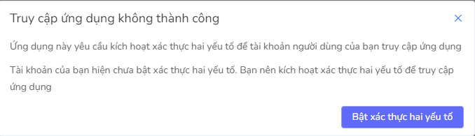

# Truy cập ứng dụng khi ứng dụng bật xác thực hai yếu tố

Chức năng này cho phép người dùng CMS truy cập ứng dụng khi ứng dụng bật xác thực hai yếu tố, mục đích **Yêu cầu mọi thành viên truy cập vào ứng dụng phải bật xác thực 2 yếu tố của tài khoản người dùng**, nhằm bổ sung thêm một lớp bảo vệ chống lại việc truy cập trái phép và giúp ngăn chặn các hình thức tấn công mạng khác nhau, như lừa đảo và trộm mật khẩu.

**Điều kiện**: 

- Người dùng có tài khoản và có quyền truy cập vào ứng dụng
- Ứng dụng muốn truy cập BẬT xác thực 2 yếu tố

**Bước 1**: Tại màn hình danh sách ứng dụng, người dùng lựa chọn ứng dụng (***đã bật xác thực hai yếu tố***) để truy cập

**Bước 2**: Hệ thống kiểm tra tài khoản người dùng về xác thực hai yếu tố

- **<u>Trường hợp 1</u>**: Nếu người dùng ***bật xác thực hai yếu tố***, chuyển sang **bước 5**
- **<u>Trường hợp 2</u>**: Nếu người dùng đang ***tắt xác thực hai yếu tố***, hệ thống hiển thị thông báo từ chối truy cập và yêu cầu người dùng bật xác thực hai yếu tố của tài khoản người dùng:

Với các thông tin sau 

- Tiêu đề: Truy cập ứng dụng không thành công

- Nội dung: Tài khoản của bạn hiện chưa bật xác thực hai yếu tố. Bạn nên kích hoạt xác thực hai yếu tố để truy cập ứng dụng

- Nút **"Bật xác thực hai yếu tố"**: khi người dùng bấm nút này, hệ thống sẽ chuyển sang màn hình cấu hình xác thực hai yếu tố của tài khoản người dùng.

**Bước 3**: Người dùng bấm nút **"Bật xác thực hai yếu tố"**, hệ thống sẽ chuyển sang màn hình cấu hình xác thực hai yếu tố của tài khoản người dùng.

**Bước 4**: Người dùng thực hiện bật xác thực hai yếu tố thành công, sau đó thực hiện lại **Bước 1**

**Bước 5**: Truy cập thành công ứng dụng, hiển thị màn hình tổng quan ứng dụng