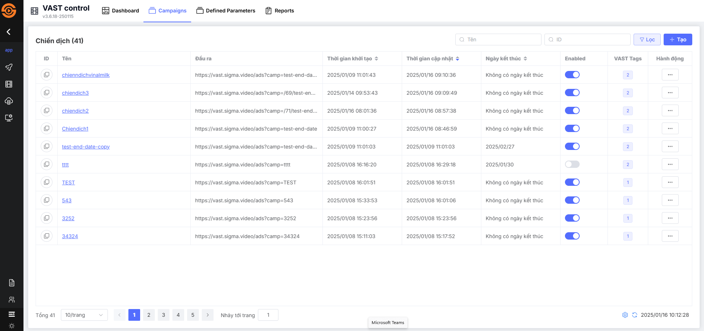
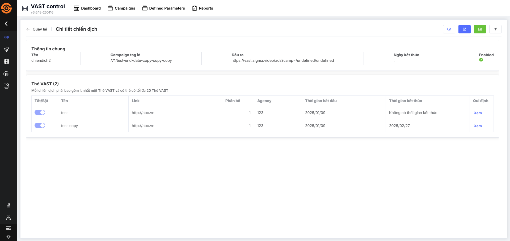
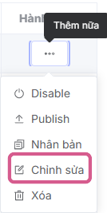
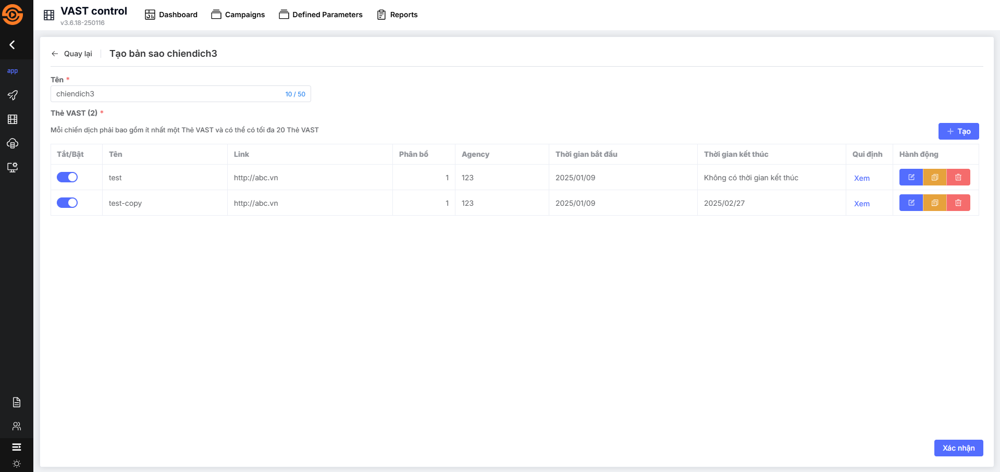

## Quản lý chiến dịch
VAST Control cho phép bạn quản lý và tổ chức các chiến dịch phân phối quảng cáo một cách dễ dàng và hiệu quả. Đây là công cụ mạnh mẽ hỗ trợ bạn tối ưu hóa hoạt động quảng cáo với các tính năng nổi bật như:

* **Tạo chiến dịch:** Thiết lập các chiến dịch quảng cáo với các thông số chi tiết để đáp ứng mục tiêu phân phối.
* **Tìm kiếm nhanh:** Dễ dàng truy cập và quản lý chiến dịch thông qua công cụ tìm kiếm thông minh.
* **Quản lý linh hoạt:** Theo dõi, chỉnh sửa và tối ưu hóa các chiến dịch đang hoạt động theo thời gian thực.

Công cụ này giúp bạn tiết kiệm thời gian, tối ưu hóa quy trình làm việc và đảm bảo chiến dịch quảng cáo đạt hiệu quả tối đa.

## Xem danh sách chiến dịch
Giao diện danh sách các chiến dịch là một phần quan trọng trong việc quản lý chiến dịch. Giao diện trong danh sách bao gồm các thông tin cơ bản về chiến dịch như ID, tên, đầu ra, thời gian khởi tạo,... và cho phép tìm kếm, giúp người quản trị viên có cái nhìn tổng quan.

**Bước 1:** Tại sidebar menu bên tay trái, người dùng di chuyển con trỏ chuột vào **Application** và chọn **Vast Control**

Màn hình chính hệ thống hiển thị giao diện Dashboard (theo dõi được tổng quan những thông tin chỉ số liên quan đến **Vast Control**) [Xem chi tiết tại đây](../dashboard.md)

**Bước 2:** Người dùng chọn tab **Campaigns**

Màn hình hiển thị danh sách chiến dịch, với các thông tin chính bao gồm:

|Tên cột       | Chức năng                                                    |
| -------------- | ------------------------------------------------------------ |
| **ID**         | Sau khi người dùng tạo mới chiến dịch, hệ thống sinh ra ID riêng cho mỗi chiến dịch với mục đích nhận diện  Hiển thị dưới dạng nút, cho phép hover để xem ID và bấm vào để sao chép |
| **Tên**        | Tên của chiến dịch             |
| **Đầu ra**      | Sau khi người dùng tạo mới chiến dịch, hệ thống sinh ra đầu ra của mỗi chiến dịch để có thể liên kết với sản phẩm SSAI  Cho phép hover để xem đầu ra và bấm vào để sao chép|
| **Thời gian khởi tạo** |Thời gian khởi tạo chiến dịch
|**Thời gian cập nhật**|Thời gian cập nhật chiến dịch
|**Ngày kết thúc**|Thời gian kết thúc chiến dịch
|**Enabled**|Số lượng VAST Tags chứa trong chiến dịch
|**VAST Tags**|Thời gian kết thúc chiến dịch
|**Hành động**|**Enable/Disable chiến dịch**: Cho phép người dùng kích hoạt hoặc hủy kích hoạt chiến dịch. **Publish chiến dịch**: Cho phép người dùng xuất bản chiến dịch. **Nhân bản chiến dịch**: Cho phép người dùng tạo ra một bản sao chiến dịch mới. **Chỉnh sửa chiến dịch**: Cho phép người dùng chỉnh sửa thông tin chiến dịch. **Xóa chiến dịch**: Cho phép người dùng CMS thực hiện xoá chiến dịch.

* **Các nút khác**

|Tên nút       | Chức năng                                                    |
| -------------- | ------------------------------------------------------------ |
| **Tạo**         | Thực hiện tạo chiến dịch mới |
| **Lọc**        | Thực hiện lọc các thông tin chi tiết hơn, bao gồm: **Thời gian cập nhật, Thời gian khởi tạo, Enabled, Đầu ra, Tên, ID**             |
| **Quick filter**      | Bộ lọc nhanh hỗ trợ tìm kiếm thông tin gồm: **Tên, ID**|
| **Phân trang** |Góc trái bên dưới giao diện Bao gồm các thông tin: Tổng số trang, lựa chọn số items/1 trang (mặc định 10 items/1 trang), trang hiện tại, nhảy tới trang mong muốn tìm kiếm.
| **Icon đồng bộ** |Góc phải bên dưới giao diện, thực hiện thiết lập đồng bộ cho hệ thống:  * Các thiết lập để hệ thống tự động đồng bộ (mặc định: tắt tự động)  * Chủ động đồng bộ cho hệ thống (bằng cách nhấn vào biểu tượng)  * Thời gian hệ thống đồng bộ gần nhất

## Các hành động
### Tạo chiến dịch
Tạo chiến dịch trong VAST Control giúp bạn nhanh chóng thiết lập và quản lý các chiến dịch quảng cáo một cách hiệu quả, tối ưu hóa quy trình phân phối và theo dõi hiệu suất.

[Xem chi tiết tại đây](./b-tao-chien-dich.md)

### Xem chi tiết chiến dịch
Để thực hiện quá trình này, cần phải có ít nhất một chiến dịch đã được tạo trước đó và hiển thị trong danh sách.

1. Tại giao diện Danh sách chiến dịch, nhấn vào **[Tên chiến dịch]** mong muốn xem thông tin chi tiết chiến dịch
2. Hiển thị giao diện chi tiết chiến dịch với các thông tin sau:
   

* **Tên:** Tên chiến dịch
* **Campaign tag id:** Hệ thống sinh ra Campaign tag id riêng cho mỗi chiến dịch với mục đích nhận diện. 
* **Đầu ra:** Hệ thống sinh ra đầu ra của mỗi chiến dịch để có thể liên kết với sản phẩm SSAI
* **Ngày kết thúc:** Ngày kết thúc chiến dịch
* **Enabled:** Trạng thái của chiến dịch
* ***Danh sách VAST Tags gồm có:***
* **Tắt/Bật:** Trạng thái kích hoạt của VAST Tag
* **Tên:** Tên VAST Tag
* **Link:** Link VAST Tag
* **Phân bổ:** Hiển thị trọng số phân bổ của các VAST Tag
* **Agency:** Tên công ty quảng cáo
* **Thời gian bắt đầu:** Thời gian bắt đầu chạy của VAST Tag
* **Thời gian kết thúc:** Thời gian kết thúc lịch chạy của VAST Tag
* **Qui định:** Những qui định về quảng cáo đối với VAST Tag đã được cấu hình ví dụ như độ tuổi, giới tính…. Cho phép người dùng click xem thông tin chi tiết về qui định

## Chỉnh sửa chiến dịch
Để thực hiện quá trình này, cần phải có ít nhất một chiến dịch đã được tạo trước đó và hiển thị trong danh sách.

**Bước 1:** Trong danh sách, tại cột Hành động, click chuột vào biểu tượng ba chấm và lựa chọn hành động chỉnh sửa

Hệ thống điều hướng đến màn hình chỉnh sửa chiến dịch

Tại màn hình chỉnh sửa, người dùng có thể thực hiện thay đổi các thông tin của chiến dịch và sau đó nhấn button **xác nhận** để cập nhật lại thông tin

Sau khi người dùng nhấn **xác nhận** , hệ thống tự động chuyển về màn hình danh sách chiến dịch và hiển thị thông báo thực hiện **Chỉnh sửa chiến dịch thành công** ở góc phải màn hình và tự động đóng thông báo sau 5 giây. 

## Nhân bản chiến dịch
Người dùng muốn tạo một bản sao chiến dịch  với thông tin đã có trước đó, giữ các cài đặt bắt buộc và thông tin của chiến dịch.

Để thực hiện quá trình này, cần phải có ít nhất một chiến dịch đã được tạo trước đó và hiển thị trong danh sách.

**Bước 1:** Trong danh sách, tại cột Hành động, click chuột vào biểu tượng ba chấm và lựa chọn hành động nhân bản

Sau đó hiển thị màn hình thông tin cấu hình chiến dịch với thông tin đã được thiết lập trước đó. Cho phép chỉnh sửa tất cả các trường.

**Bước 2:** Người dùng nhập thông tin cần thiết và người dùng nhấn nút **Xác nhận**
Hệ thống hiển thị thông báo thực hiện **Sao chép chiến dịch thành công** ở góc phải màn hình và tự động đóng thông báo sau 5 giây.

## Xóa chiến dịch
Để thực hiện quá trình này, cần phải có ít nhất một chiến dịch đã được tạo trước đó và hiển thị trong danh sách.

**Bước 1 :** Trên màn hình danh sách chiến dịch, tại chiến dịch mà bạn muốn xoá, di chuột vào hành động Xoá ở cột Hành động, và sau đó nhấn **Xóa**

Hệ thống sẽ hiển thị một cửa sổ pop-up xác nhận ở trung tâm màn hình

**Bước 2 :** Người dùng nhấn nút **Xác nhận** để xoá thông tin chiến dịch
Hệ thống hiển thị một thông báo **Đã xoá thành công!** ở góc phải màn hình và tự động đóng thông báo sau 5 giây.Đồng thời, hệ thống thực hiện xoá toàn bộ thông tin chiến dịch

## Enable/Disable chiến dịch
Để thực hiện quá trình này, cần phải có ít nhất một chiến dịch đã được tạo trước đó và hiển thị trong danh sách.

**Bước 1 :** Trên màn hình danh sách chiến dịch, tại chiến dịch mà bạn muốn **Enable/Disable**, di chuột vào hành động **Enable/Disable** ở cột Hành động, và sau đó nhấn **Enable/Disable**. Lưu ý: Đối với các chiến dịch đang ở trạng thái ngưng kích hoạt, nút này sẽ hiển thị là **Enable**. Ngược lại, nếu chiến dịch đang được kích hoạt, nút này sẽ hiển thị là **Disable**

Hệ thống sẽ hiển thị một cửa sổ pop-up xác nhận ở trung tâm màn hình

**Bước 2 :** Người dùng nhấn nút Xác nhận để  **Enable/Disable** chiến dịch
Hệ thống hiển thị một thông báo **Cập nhật thành công** ở góc phải màn hình và tự động đóng thông báo sau 5 giây.

## Publish chiến dịch
Để thực hiện quá trình này, cần phải có ít nhất một chiến dịch đã được tạo trước đó và hiển thị trong danh sách.

**Bước 1 :** Trên màn hình danh sách chiến dịch, tại chiến dịch mà bạn muốn **Publish**, di chuột vào hành động **Publish** ở cột Hành động, và sau đó nhấn **Publish**. 

Hệ thống sẽ hiển thị một cửa sổ pop-up để người dùng lựa chọn các endpoints ở sản phẩm SSAI sử dụng đầu ra của chiến dịch và cấu hình link publish theo nhu cầu của người dùng

**Bước 2 :** Người dùng nhấn nút **Lưu**
Hệ thống hiển thị một thông báo **Xuất bản thành công** ở góc phải màn hình và tự động đóng thông báo sau 5 giây.

