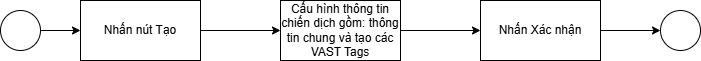
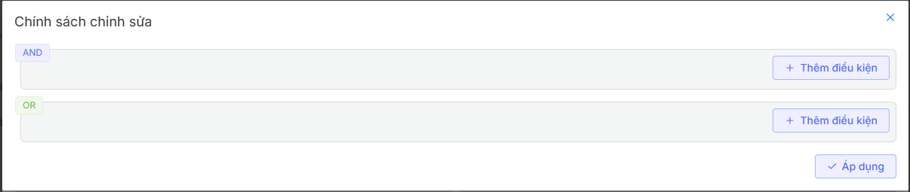
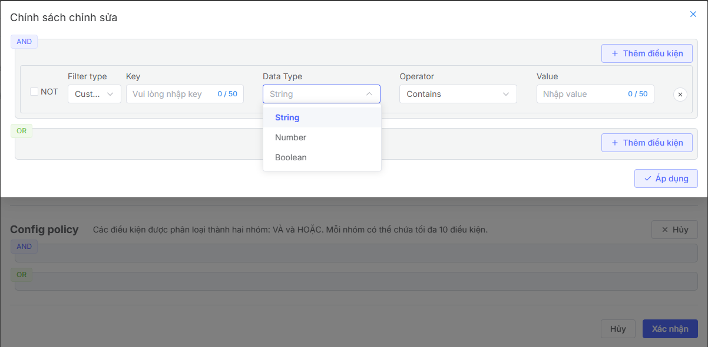
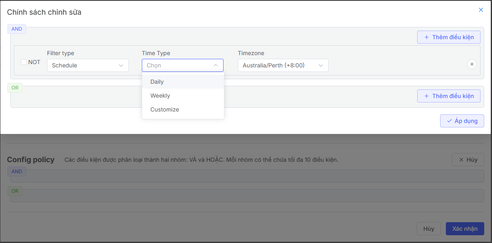
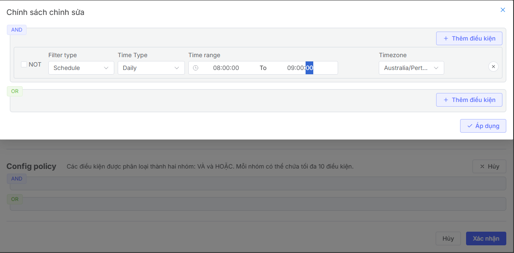
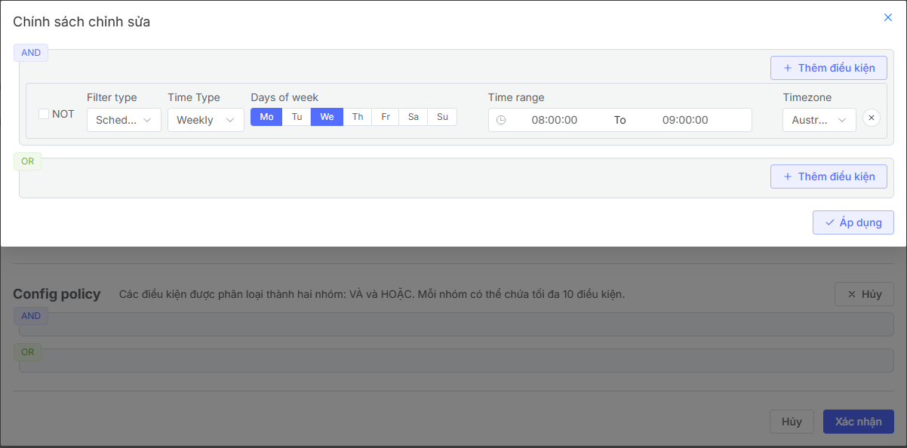

## Tạo chiến dịch

## Tổng quan về chức năng
Chức năng tạo chiến dịch cho phép bạn:

* Thiết lập chiến dịch mới với các thông số chi tiết.
* Quản lý và theo dõi hiệu suất chiến dịch trong thời gian thực.
* Tối ưu hóa chiến lược quảng cáo thông qua các công cụ phân tích và báo cáo

## Luồng
Quá trình tạo chiến dich người dùng cần thực hiện 

## Tạo mới chiến dịch
Để tạo mới một chiến dịch, người dùng cần khởi tạo một chiến dịch theo các bước sau:

1. Truy cập vào trang quản lý Vast Control.
2. Hiển thị trang danh sách các chiến dịch.
3. Nhấp vào nút Tạo để bắt đầu tạo chiến dịch.
4. Chuyển đến trang Tạo mới chiến dịch

**Bước 1: Nhập tên chiến dịch**

**Bước 2: Thiết lập VAST Tags**
1. Nhấn Tạo hoặc Tạo thẻ VAST để tạo VAST Tag mới

2. Hệ thống hiển thị pop-up để người dùng cấu hình thông tin VAST Tag

2.1. Người dùng tiến hành cấu hình các thông tin chung của VAST Tag gồm có: Tên, Liên kết, Phân bổ, Hãng (Agency) , Thời gian bắt đầu, thời gian kết thức của VAST Tags

2.2. Người dùng tiến hành cấu hình các điều kiện, qui định của VAST Tag bằng cách nhấn vào nút **Chỉnh sửa** tại phần Config Policy

Phần điều kiện, qui định này cho phép người dùng cấu hình các điều kiện theo các mối quan hệ AND hoặc OR.

2.3. Nhấn Thêm điều kiện để thực hiện cấu hình các điều kiện cụ thể 

Hệ thống cung cấp 3 loại quy định gồm có:

**Defined parameter:** Các param đã được định nghĩa sẵn cho phép người dùng dùng lại. Xem thêm tại đây 
**Custom parameter:** Các param được tạo mới tùy ý gồm các trường: Key, Data Type, Operator, Value

**Schedule:** Cấu hình về thời gian. Có các loại cấu hình về thời gian như sau:

**Daily:** Cho phép người dùng chọn khoảng thời gian nhất định trong ngày. Ví dụ cấu hình chạy trong khoảng thời gian từ 8:00:00 -9:00:00 thì quảng cáo sẽ được chạy trong khoảng thời gian  8:00:00 -9:00:00 trong tất cả các ngày trong lịch chạy của chiến dịch.

**Weekly:** Cho phép người dùng chọn khoảng thời gian nhất định trong ngày cố định trong tuần. Ví dụ cấu hình chạy trong khoảng thời gian từ 8:00:00 -9:00:00 vào thứ 2 và thứ 4 hàng tuần thì quảng cáo sẽ được chạy trong khoảng thời gian  8:00:00 -9:00:00 thứ 2 và thứ 4 trong khoảng thời gian lịch chạy của chiến dịch.

**Customize:** Cho phép người dùng lựa chọn thời gian chạy quảng cáo cụ thể theo ngày và giờ

**Bước 3:** Sau khi đã tạo xong các VAST Tags, người dùng nhấn **xác nhận** để tạo thành công chiến dịch

 

