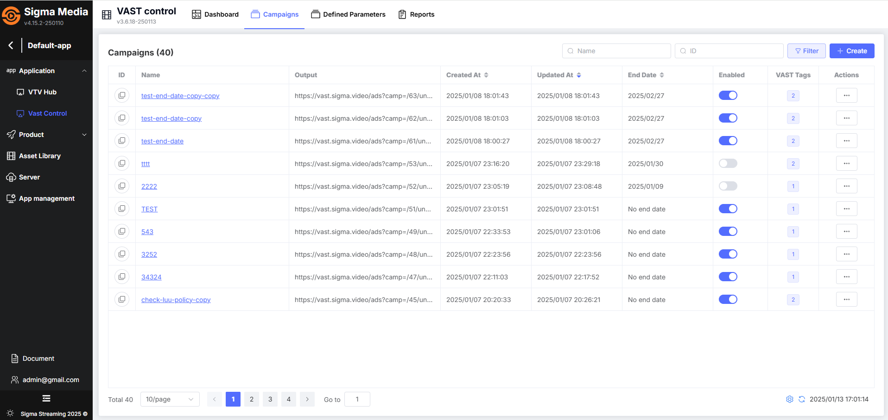
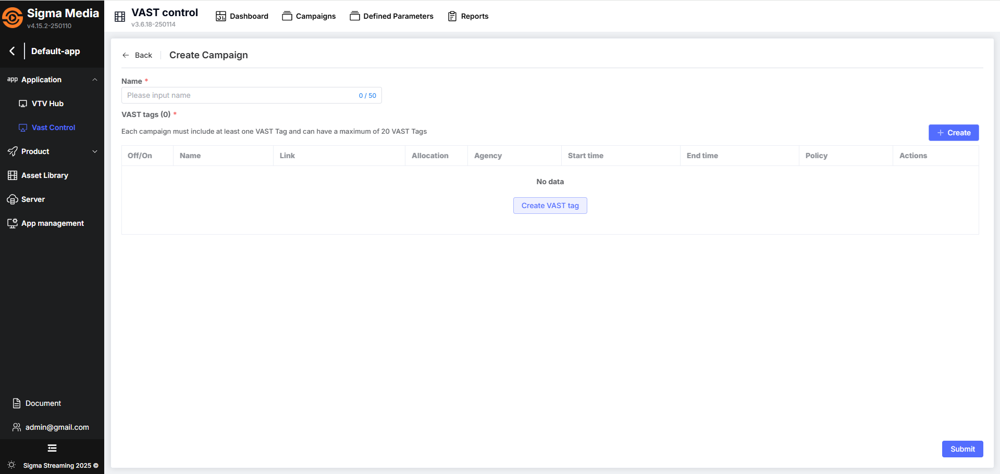

## Bắt đầu với VAST Control
## Chuẩn bị
Trước khi bắt đầu, bạn cần chuẩn bị các tác vụ sau:
- Có tài khoản truy cập hệ thống quản lý của **Sigma Streaming Platform** `https://portal.sigma.video`
- Tài khoản có quyền truy cập app được phân quyền với Vast Control.
- Chuẩn bị về danh sách link các vast tag định dạng url

## Luồng thực hiện

## Truy cập vào hệ thống Sigma Streaming
Thực hiện Đăng kí tài khoản hoặc đăng nhập để truy cập hệ thống quản lý của Sigma Streaming Platform https://portal.sigma.video

Hiển thị Danh sách ứng dụng, chọn ứng dụng cần truy cập.

Hiển thị mặc định vào trang tổng quan ứng dụng.

## Vào Application Vast Control

1. Tại Sidebar, lựa chọn Application Vast Control
2. Chọn tab chiến dịch

## Tạo mới chiến dịch
Để tạo mới một chiến dịch, bạn cần làm theo các bước như sau: 

1. Truy cập trang quản lý danh sách chiến dịch
2. Tại màn hình danh sách chiến dịch, nhấn button **Tạo** hoặc **Tạo chiến dịch**
3. Đi tới màn hình tạo chiến dịch
4. Điền đầy đủ các thông tin cần có gồm:
  * Tên chiến dịch
  * Tạo danh sách các VAST Tags
  
  

5. Nhấn button **Xác nhận** sau khi đã cấu hình xong các thông tin cần thiết 
6. Hệ thống sẽ tiến hành tạo chiến dịch và sau đó cập nhật lại danh sách chiến dịch hiện có

[Xem chi tiết tại đây](../03-user-maunal/campaign/b-tao-chien-dich.md)

## Quản lý chiến dịch
Tại danh sách chiến dịch, bạn có thể xem danh sách các thông tin của một chiến dịch gồm có:

* **ID**: ID của chiến dịch và bạn có thể copy bằng cách nhấn vào icon ID
* **Tên**: tên chiến dịch
* **Đầu ra**: do hệ thống tự gen của chiến dịch
* **Ngày khởi tạo**: Thời gian tạo chiến dịch
* **Ngày cập nhật**: Thời gian cập nhật chiến dịch
* **Ngày kết thúc**: Thời gian kết thúc lịch chạy của chiến dịch
* **Enabled**: Trạng thái enable/disable của chiến dịch
* **VAST Tags**: Số lượng VAST Tags chứa trong chiến dịch
* **Hành động**: Các hành động được phép thực hiện với chiến dịch

Nhấn vào **“tên chiến dịch”** để xem thông tin chi tiết bao gồm:
* Thông tin chung
* Thông tin về VAST Tags

[Xem chi tiết tại đây](../03-user-maunal/campaign/a-quan-ly-chien-dich.md)

## Chỉnh sửa chiến dịch
Bạn có thể thực hiện hành động chỉnh sửa chiến dịch bằng cách nhấn three-dot tại cột hành động và lựa chọn Chỉnh sửa. Sau đó thực hiện theo các bước sau:

1. Tại màn hình chỉnh sửa, bạn chỉnh sửa các thông tin tùy ý 
2. Nhấn Xác nhận sau khi đã chỉnh sửa xong
3. Hệ thống sẽ tiến hành cập nhật lại các thông tin của chiến dịch 

[Xem chi tiết tại đây](../03-user-maunal/campaign/a-quan-ly-chien-dich.md)

## Enable/Disable chiến dịch
Bạn có thể thực hiện hành động Enable/Disable chiến dịch bằng cách nhấn three-dot tại cột hành động và lựa chọn Enable/Disbale.

[Xem chi tiết tại đây](../03-user-maunal/campaign/a-quan-ly-chien-dich.md)

## Publish chiến dịch
Bạn có thể thực hiện hành động Publish chiến dịch bằng cách nhấn three-dot tại cột hành động và lựa chọn Publish.

[Xem chi tiết tại đây](../03-user-maunal/campaign/a-quan-ly-chien-dich.md)

## Xóa chiến dịch
Sau khi đã tạo và chạy thành công các chiến dịch. Sau đó, vì một bất kỳ lý do nào đó, bạn cảm thấy chiến dịch đó không cần thiết nữa, bạn cần thực hiện thao tác xóa

[Xem chi tiết tại đây](../03-user-maunal/campaign/a-quan-ly-chien-dich.md)