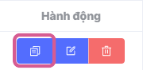
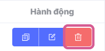

## Danh sách defined paramter
**Defined parameter** là một giá trị đã được định nghĩa trước để mục đích sử dụng lại, giúp tiết kiệm thời gian. Nó giống như bạn đặt một "mục tiêu" hoặc "quy tắc" để đảm bảo mọi thứ hoạt động theo ý bạn.

### Xem danh sách defined parameter
Giao diện danh sách các **defined parameters** là một phần cốt lõi trong việc quản lý chiến dịch, bởi nó cung cấp cho người dùng khả năng kiểm soát toàn diện và tối ưu hóa chiến dịch. Người dùng có thể nhanh chóng cập nhật, kiểm tra hoặc sửa đổi tham số mà không cần tìm kiếm ở nhiều nơi khác nhau.

**Bước 1:** Tại sidebar menu bên tay trái, người dùng di chuyển con trỏ chuột vào **Application** và chọn **Vast Control**

Màn hình chính hệ thống hiển thị giao diện Dashboard (theo dõi được tổng quan những thông tin chỉ số liên quan đến Vast Control) [Xem chi tiết tại đây](../dashboard.md)

**Bước 2:** Người dùng chọn tab **Defined Parameters**

Màn hình hiển thị danh sách Defined Parameters, với các thông tin chính bao gồm:

|Tên cột       | Chức năng                                                    |
| -------------- | ------------------------------------------------------------ |
| **Key**         |Tên tham số |
| **Data Type**   |Kiểu dữ liệu tham số        |
| **Thời gian khởi tạo**      | Thời gian khởi tạo tham số|
| **Thời gian cập nhật** |Thời gian cập nhật tham số|
| **Hành động** |**Nhân bản defined parameter:** Cho phép người dùng tạo ra một bản sao mới defined parameter **Chỉnh sửa defined parameter:** Cho phép người dùng chỉnh sửa thông tin defined parameter. **Xóa defined parameter:** Cho phép người dùng CMS thực hiện xoá defined parameter.

* Các nút khác

|Tên nút       | Chức năng                                                    |
| -------------- | ------------------------------------------------------------ |
| **Phân trang**         |Góc trái bên dưới giao diện Bao gồm các thông tin: Tổng số trang, lựa chọn số items/1 trang (mặc định 10 items/1 trang), trang hiện tại, nhảy tới trang mong muốn tìm kiếm. |
| **Icon đồng bộ**   |Góc phải bên dưới giao diện, thực hiện thiết lập đồng bộ cho hệ thống:  * Các thiết lập để hệ thống tự động đồng bộ (mặc định: tắt tự động)  * Chủ động đồng bộ cho hệ thống (bằng cách nhấn vào biểu tượng)  * Thời gian hệ thống đồng bộ gần nhất        |

## Các hành động

### Tạo defined parameter
Tạo sẵn defined parameter giúp bạn nhanh chóng thiết lập các chiến dịch quảng cáo.

[Xem chi tiết tại đây](b-tao-defined-parameter.md)

### Chỉnh sửa defined parameter
Để thực hiện quá trình này, cần phải có ít nhất một defined parameter đã được tạo trước đó và hiển thị trong danh sách.

**Bước 1:** Trong danh sách, di chuột vào biểu tượng **chỉnh sửa** ở cột Hành động tại parameter bạn muốn **chỉnh sửa**, hiển thị tooltip text **chỉnh sửa**, nhấp vào biểu tượng.

Sau đó hiển thị pop-up thông tin cấu hình **defined parameter** với thông tin đã được thiết lập trước đó. Cho phép chỉnh sửa tất cả các trường.

**Bước 2:** Người dùng chỉnh sửa các thông tin mong muốn và nhấn nút **Lưu**

Hệ thống hiển thị thông báo thực hiện **Cập nhật thông số được xác định thành công** ở góc phải màn hình và tự động đóng thông báo sau 5 giây.

### Nhân bản defined parameter
Để thực hiện quá trình này, cần phải có ít nhất một **defined parameter** đã được tạo trước đó và hiển thị trong danh sách.

**Bước 1:** Trong danh sách, di chuột vào biểu tượng **nhân bản** ở cột Hành động tại parameter bạn muốn nhân bản, hiển thị tooltip text nhân bản, nhấp vào biểu tượng.

Sau đó hiển thị pop-up thông tin cấu hình defined parameter với thông tin đã được thiết lập trước đó. Cho phép chỉnh sửa tất cả các trường.

**Bước 2:** Người dùng nhập thông tin cần thiết và nhấn nút **Lưu**

Hệ thống hiển thị thông báo thực hiện **Tham số được xác định được nhân bản thành công** ở góc phải màn hình và tự động đóng thông báo sau 5 giây.

### Xóa defined parameter
Để thực hiện quá trình này, cần phải có ít nhất một **defined parameter** đã được tạo trước đó và hiển thị trong danh sách.

**Bước 1:** Trong danh sách, di chuột vào biểu tượng **Xóa** ở cột Hành động tại parameter bạn muốn Xóa, hiển thị tooltip text **Xóa**, nhấp vào biểu tượng.

Hệ thống sẽ hiển thị một cửa sổ pop-up xác nhận ở trung tâm màn hình

**Bước 2 :** Người dùng nhấn nút **Xác nhận** để xoá thông tin defined parameter

Hệ thống hiển thị một thông báo **Đã xoá thành công!** ở góc phải màn hình và tự động đóng thông báo sau 5 giây.

Đồng thời, hệ thống thực hiện **xoá toàn bộ thông tin defined parameter**
