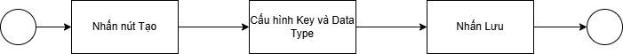
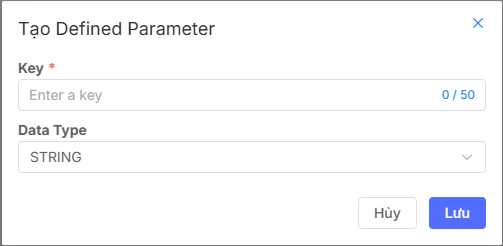
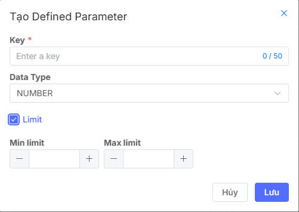

## Tạo defined parameter

### Tổng quan về chức năng
Chức năng tạo defined parameter cho phép bạn:

* Định nghĩa tham số với kiểu dữ liệu, giá trị mặc định
* Tùy chỉnh linh hoạt theo nhu cầu sử dụng.
* Áp dụng dễ dàng trong quy trình và ứng dụng.
* Tăng hiệu quả nhờ tự động hóa và giảm cấu hình thủ công.

### Luồng
Quá trình tạo defined parameter người dùng cần thực hiện 

### Tạo mới defined parameter
Để tạo mới một **defined parameter**, người dùng cần khởi tạo theo các bước sau:

1. Truy cập vào trang quản lý Vast Control.
2. Vào màn  danh sách các defined parameter
3. Nhấp vào nút Tạo để bắt đầu tạo defined parameter
4. Hiển thị pop-up tạo defined parameter

**Bước 1: Nhập tên key**

**Bước 2: Thiết lập Data type của key**
Hiện tại, hệ thống hỗ trợ các loại Data type gồm có: **String, Number, Boolean, Enum**. Mặc định là **String**. Với những Data type khác nhau, hệ thống sẽ hiển thị form cấu hình khác nhau.

Ví dụ, lưu ý một số form đặc biệt như Number → hệ thống cho phép người dùng thiết lập giới hạn theo mong muốn bằng cách tích vào ô Limit. Khi tích vào ô Limit, hệ thống cho phép người dùng nhập giới hạn nhỏ nhất và lớn nhất của key value

Đối với Data type là **Enum**, hệ thống cho phép người dùng cấu hình danh sách các giá trị của **enum** bằng cách nhấn vào button **Giá trị mới**. Cho phép nhập tối đa **20** giá trị enum

**Bước 3: Nhấn lưu**
Sau khi đã hoàn thành các thiết lập trên, người dùng nhấn **Lưu** để hoàn tất quá trình Tạo Defined Parameter