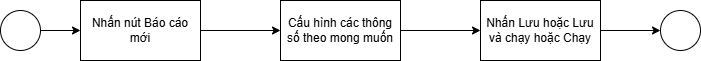
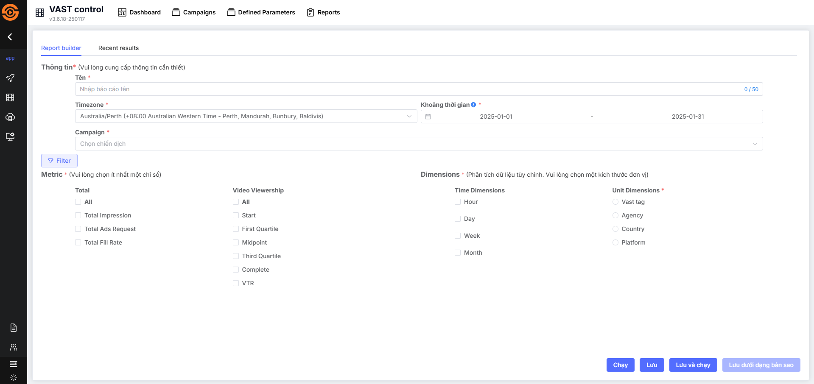
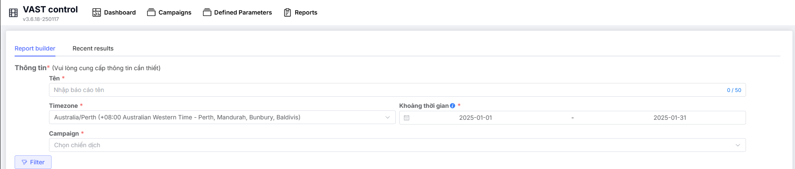
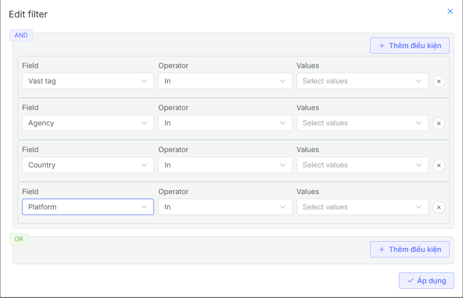
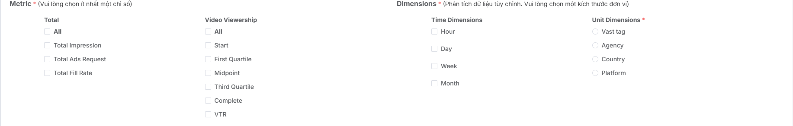

## Tạo báo cáo
### Tổng quan về chức năng
Chức năng tạo báo cáo cho phép bạn:

* **Tùy chỉnh báo cáo:** Lựa chọn các chỉ số, bộ lọc, chia nhỏ dữ liệu hiển thị theo nhu cầu.
* **Khai thác dữ liệu:** Trích xuất thông tin từ nhiều nguồn và hiển thị một cách trực quan.
* 
* **Tăng hiệu quả làm việc:** Giảm thời gian xử lý dữ liệu và hỗ trợ ra quyết định nhanh chóng.

### Luồng
Quá trình tạo báo cáo người dùng cần thực hiện

### Tạo mới báo cáo
Để tạo mới một báo cáo người dùng cần làm theo các bước sau:

1. Truy cập vào trang quản lý Vast Control.
2. Vào màn  danh sách báo cáo
3. Nhấp vào nút **Báo cáo mới** để bắt đầu tạo báo cáo
4. Hiển thị màn hình Report Builder để người dùng thiết lập các thông số theo mong muốn

**Bước 1: Hoàn thiện mục thông tin**

Tại mục hoàn thiện thông tin, người dùng cần cấu hình các thông tin sau:

* Tên báo cáo
* Lựa chọn timezone để tạo báo cáo
* Lựa chọn khoảng thời gian muốn tạo báo cáo
* Lựa chọn chiến dịch muốn lập báo cáo. Lưu ý, hiện tại hệ thống chỉ hỗ trợ lập báo cáo mỗi lần một chiến dịch
* Sau khi đã lựa chọn báo cáo, người dùng lựa chọn các thông số cần cho chiến dịch bằng cách nhấn vào nút **Filter**

Tại phần **Filter** này, người dùng có thể cấu hình theo các tham số vast tag, agency, country hoặc platform

**Bước 2: Thiết lập các Metric và Dimensions**

Metric là các thông số người dùng muốn lập báo cáo. Hiện tại, hệ thống cho phép chọn một hoặc nhiều thông số

Dimensions là cách báo cáo chia nhỏ dữ liệu. Có hai dạng chia nhỏ dữ liệu:

Chia nhỏ dữ liệu theo thời gian. Hệ thống hỗ trợ chia nhỏ dữ liệu theo giờ, ngày, tuần, tháng. Đối với mỗi một đơn vị chia nhỏ sẽ có mức khoảng thời gian lập báo cáo khác nhau:

* Nếu lập báo cáo chia nhỏ theo giờ, bạn chỉ có thể lập báo cáo được tối đa 1 ngày
* Nếu lập báo cáo chia nhỏ theo ngày, bạn chỉ có thể lập báo cáo tối đa 31 ngày
* Nếu lập báo cáo chia nhỏ theo tuần, bạn chỉ có thể lập báo cáo tối đa 3 tháng 
* Nếu lập báo cáo chia nhỏ theo tháng, bạn chỉ có thể lập báo cáo tối đa 6 tháng 
* Nếu bạn không muốn chia nhỏ dữ liệu theo thời gian, bạn có thể lập báo cáo tối đa 1 năm

Chia nhỏ dữ liệu theo đơn vị kích thước. Hệ thống hỗ trợ chia nhỏ dữ liệu theo các đơn vị kích thước như sau: vast tag, agency, country, platform. Nếu bạn chọn chia nhỏ dữ liệu theo đơn vị kích thước nào thì hệ thống sẽ gom dữ liệu theo từng đơn vị kích thước đó. 

**Bước 3: Thiết lập phần lập lịch gửi báo cáo**

Chức năng báo cáo lập lịch cho phép người dùng thiết lập việc tạo và gửi báo cáo định kỳ đến các địa chỉ email được chỉ định.

**Thiết lập lịch trình**: 

* **Lịch trình** (Bắt buộc): Chọn tần suất gửi báo cáo. Có thể chọn các loại như sau: Không lập lịch, hàng tuần, hàng tháng, hàng ngày

* **Thời gian dự kiến** (Bắt buộc): Chọn thời gian cụ thể trong ngày mà báo cáo sẽ được gửi. Ví dụ: 05:00 (tức là 5 giờ sáng theo múi giờ Asia/Ho_Chi_Minh).

* **Lưu ý**: Khi chọn Monthly, báo cáo sẽ tự động gửi vào ngày đầu tiên của mỗi tháng.

**Thêm người nhận báo cáo**:

* Trong ô Thêm người nhận, nhập địa chỉ email của người muốn nhận báo cáo. Tối đa 20 email

* Nếu cần gửi báo cáo ngay, nhấn nút "**Gửi ngay bây giờ**" để hệ thống tạo và gửi báo cáo đến danh sách người nhận.

**Bước 4: Nhấn nút Lưu hoặc Lưu và Chạy để tạo báo cáo thành công**

Sau khi đã hoàn thiện các thông tin ở **Bước 1** và **Bước 2**, người dùng có thể có các lựa chọn như sau: 

* Nhấn **Lưu**, hệ thống tự động chuyển về màn hình danh sách báo cáo và lưu thông tin báo cáo đã được người dùng thiết lập
* Nhấn **Lưu và Chạy**, hệ thống sẽ chuyển về màn hình **Recent Results** và hiển thị số liệu báo cáo theo các thông số đã được cấu hình đồng thời lưu thông tin báo cáo tại màn hình danh sách báo cáo
* Nhấn **Chạy**, hệ thống sẽ chuyển về màn hình **Recent Results** và hiển thị số liệu báo cáo theo các thông số đã được cấu hình tuy nhiên hệ thống sẽ không lưu các thông tin báo cáo đã được người dùng cấu hình